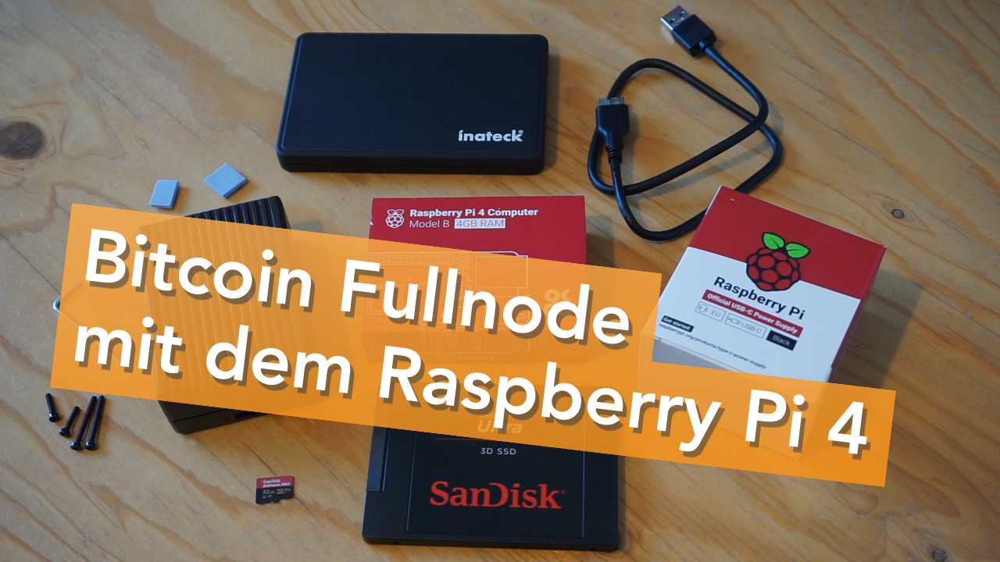

# Bitcoin Fullnode mit dem Raspberry Pi 4

Was du für einen Bitcoin Fullnode mit dem Raspberry Pi 4 brauchst und wie du die Einzelteile zusammensetzt.

Einkaufsliste:
- [Raspberry Pi 4 mit 4GB RAM](https://amzn.to/2PgXg4X)
- [Netzteil für Raspberry Pi 4](https://amzn.to/3tMGlGz)
- [SanDisk Extreme Pro 32GB microSDHC](https://amzn.to/32IG2Rc)
- [SanDisk Ultra 3D 1 TB SSD](https://amzn.to/2PkAeKE)
- [Inateck Festplattengehäuse](https://amzn.to/3nnz7Gz)

Beim Gehäuse gibt es mehrere gute Optionen, je nachdem was dir gefällt:

- [Aluminium Passiv-Kühlung](https://amzn.to/3tNJUfG)
- [FLIRC Aluminium Case](https://amzn.to/3tN66Gx)
- [Transparent mit Lüfter und Kühlkörper](https://amzn.to/3dJWjM4)
