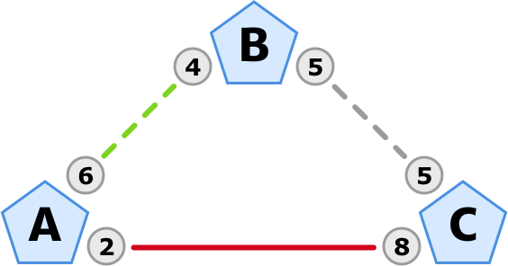
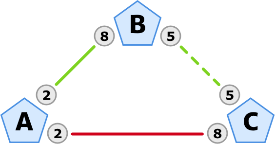
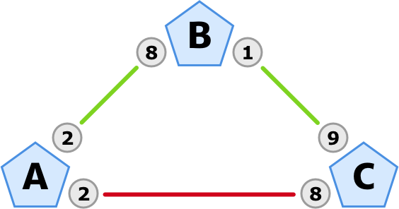

# Wie Kapazität und Liquidität das Routing im Lightning Netzwerk bestimmen

Lightning ermöglicht schnellere Transaktionen und geringere Gebühren, die durch ein Netzwerk aus bidirektionalen Zahlungskanälen möglich werden. Im Artikel zum
[Lebenszyklus eines Zahlungskanals im Lightning Netzwerk](../lightning-network-zahlungskanal/)
erfährst du, wie Zahlungen grundsätzlich funktionieren.

Über die Zahlungen innerhalb eines Kanals hinaus, kann man auch über die Verbindungen der Kanäle bezahlen:
Routing ermöglicht Zahlungen an Parteien, mit denen man nicht direkt verbunden ist — daher auch die Bezeichnung als Lightning Netzwerk.

So ist es auch möglich, über mehrere Knoten im Netzwerk hinweg jemanden anders zu bezahlen oder Geld zu empfangen.
Dabei spielen jedoch zwei Faktoren eine entscheidende Rolle:
Dieser Artikel erklärt dir, wie das Routing von der *Kapazität* und *Liquidität* der Zahlungskanäle bestimmt wird.

## Definitionen

==**Kapazität** ist definiert als der Gesamtbetrag, den ein Zahlungskanal beinhaltet.==
Bei der Kanalöffnung wird die Kapazität festgelegt, danach ist sie fix und kann zumindest mit dem aktuellen Stand der Lightning-Implementierung nicht nachträglich angepasst werden.
Dieser Gesamtbetrag wird im Lightning Netzwerk in der Einheit Millisatoshi (msat) geführt.

Mit der **Verteilung** wird beschrieben, wie der Gesamtbetrag unter den beiden Kanalpartnern aufgeteilt ist.
Diese Verteilung betrifft auch die **Liquidität**, da wir zwischen *eingehender und ausgehender Liquidität* unterscheiden müssen.

Aus der Perspektive des Benutzers ist die ==**eingehende Liquidität** der Betrag auf der anderen Seite des Kanals — also der Teil des Geldes, den man vom Gegenüber empfangen kann.==
Um ein Beispiel zu nennen: Verkäufer benötigen primär eingehende Liquidität, um Geld von ihren Kunden empfangen zu können.

Als das exakte Gegenstück dazu ist die ==**ausgehende Liquidität** der Betrag auf der eigenen Seite des Kanals — also der Teil des Geldes, den man selbst versenden kann.==
Als normaler Nutzer oder Kunde benötigt man vorwiegend ausgehende Liquidität, um Zahlungen zu machen und Einkäufe zu erledigen.

**Routing** beschreibt den Prozess einen Pfad für die Zahlung über Kanalgrenzen hinweg zu finden.
Dieses Pfadfinden wird durch die *Kapazität* und *Liquidität* aller Kanäle/Zwischenschritte auf dem Weg bestimmt, wobei die generelle Aussage gilt:
Je länger der Pfad (also je höher die Anzahl der Zwischenschritte) ist, desto eingeschränkter sind die Möglichkeiten, die sich für ein erfolgreiches Routing ergeben.

:::tip Hinweis
Hash Time-Locked Contracts (kurz: HTLC) werden verwendet, um das Geld auf dem Weg zu sichern.
Sie stellen sicher, dass das Geld auf dem Weg zum Zahlungsempfänger nicht gestohlen wird.
Die Knotenpunkte entlang der Route können Gebühren als Provision für ihre Dienstleistung erheben.
Diese Gebühren sind auch im HTLC enthalten, die jeder Knoten auf dem Weg empfängt und weitergibt.
:::

## Einschränkungen für das Routing

Nach diese Definitionen geklärt sind, kann auch eine Analogie helfen, um einen weiteren wichtigen Punkt beim Verschieben des Geldes zu verstehen:
==Stell dir die Kapazität in einem Zahlungskanal als Perlen auf einer Schnur vor.==
Oder für die Älteren unter uns: wie Perlen in einem Abakus. &nbsp;🧮 
Sie können von einer Seite zur anderen wandern, aber sie verlassen die Schnur nicht, *selbst wenn sie weitergeleitet werden*.

Die Anzahl der Perlen ist festgelegt (Kapazität), und die Seite auf der sie sich befinden (Verteilung), symbolisiert entweder die eingehende oder die ausgehende Liquidität.

Genug der trockenen Theorie, werfen wir einen Blick auf ein praktisches Beispiel:
Das folgende Diagramm zeigt einen Fall, in dem Alice (**A**) an Charlie (**C**) einen Betrag von 4 mBTC zahlen möchte (4 Milli-Bitcoin, also 4 Millionen Sats — die Einheit für die Beispiele ist willkürlich).

Das Guthaben ihres eigenen Kanals mit Charlie reicht nicht aus:
Sie hat nur eine ausgehende Liquidität von 2 (rote Linie).
Ihr Kanal mit Bob (**B**) hat jedoch eine ausgehende Liquidität von 6, so dass die Zahlung diesen Weg einschlagen kann (gestrichelte grüne Linie).

Alice muss über Bob routen, um 4 mBTC an Charlie zu senden.
Sie erstellt also eine Verbindlichkeitstransaktion mit einer HTLC, die Charlie den Betrag von 4 mBTC gewährt.
Alice sendet diese an Bob, damit er sie weitergeben kann.

Zu diesem Zeitpunkt könnte die Zahlung immer noch scheitern:
Nämlich in dem Fall, dass Bobs ausgehende Kapazität zu Charlie nicht ausreichen würde (gestrichelte graue Linie).

Was die meisten Menschen in ihrem Verständnis stört:
Bob kann die 4 mBTC, die er von Alice erhalten hat, nicht nehmen und sie in seinen Kanal mit Charlie verschieben und weitergeben.
==Der Betrag kann nicht direkt den Kanal wechseln, da die Kapazität eines jeden Kanals festgelegt ist.==
Die Weiterleitung funktioniert nur, wenn Bob's ausgehende Kapazität in seinem Kanal mit Charlie auch mindestens 4 mBTC beträgt …

## Änderung der Verteilung

Alice hat Glück, denn Bob hat eine ausgehende Kapazität von 5 mBTC in seinem Kanal mit Charlie.
Die Zahlung wird weitergeleitet, wie in der folgenden Abfolge von Diagrammen zu sehen ist.

Alice zahlt Bob 4 mBTC (grüne Linie) und Bob zahlt Charlie 4 mBTC (gestrichelte grüne Linie).

So sieht die Verteilung aus, nachdem die Weiterleitung erfolgreich durchgeführt wurde:

Alice's Weiterleitung über Bob hat die Verteilung zwischen Bob und Charlie angepasst.

:::tip Hinweis
Aufgrund der HTLCs sind die Routing-Operationen atomar.
Das bedeutet, dass entweder die gesamte Weiterleitung erfolgreich ist oder nichts passiert.
Um eine verständlichere Erklärung zu geben, zeigen die Diagramme jedoch einen schrittweisen Weg der Übertragung.
:::

Wie wir sehen können, hat die Weiterleitung der Zahlung von Alice an Charlie über Bob die Salden aller Kanäle auf dem Weg verändert:

- A-B änderte sich von 6-4 zu 2-8
- B-C änderte sich von  5-5 zu 1-9

Dies ist insbesondere für eine weitere Art von Akteuren im Netzwerk von Bedeutung:
Die Betreiber von Routingknoten müssen ihre Kanäle fortwährend ausbalancieren, um die richtige Art von Liquidität für den jeweiligen Geldfluss zu gewährleisten.

Um diese Punkte kurz zusammenzufassen, könnte man sagen:

- Händler brauchen eingehende Liquidität.
- Kunden benötigen ausgehende Liquidität.
- Routingkonten-Betreiber müssen die Verteilungen für die Geldströme anpassen.

Diese Punkte sind derzeit ein großes Thema beim Aufbau der Kanäle eines neuen Lightning-Knotens:
Da Kanalkapazität und Liquidität die einschränkenden Faktoren sind, gibt es Dienste, die auf die Bedürfnisse von Händlern eingehen:
Der Kanalöffnungsdienst [Thor von Bitrefill](https://www.bitrefill.com/thor-lightning-network-channels/) war meines Wissens nach der erste und wurde schnell von [Lightning Labs' Loop](https://blog.lightning.engineering/posts/2019/03/20/loop.html) gefolgt.

## Zukünftige Entwicklung

Aber nicht nur Händler sind auf eingehende Liquidität angewiesen.
Wie wir gesehen haben, stoßen die Kunden aufgrund der Länge ihres Zahlungsweges an Grenzen.

Um dies zu beheben, wird bereits an Lösungen wie [Multi-Path Payments](https://lightning.engineering/posts/2020-05-07-mpp/) gearbeitet:
Statt über eine einzige Route zu gehen, kann der gesendete Betrag aufgeteilt werden und mehrere verschiedene Routen nehmen.
Auf diese Weise werden größere Zahlungen ermöglicht, da die Kapazität und die Verteiliung mehrerer Kanäle berücksichtigt werden können.
Ein Beispiel: Mit MPP könnte die Zahlung von Alice an Charlie so aufgeteilt werden, dass 2 mBTC über Bob gehen und die anderen 2 mBTC über einen anderen Knoten **D** als Zwischenschritt.

Dies ist nur eines von vielen spannenden Features, die derzeit ihren Weg in die Lightning Network Spezifikation finden. 😀
