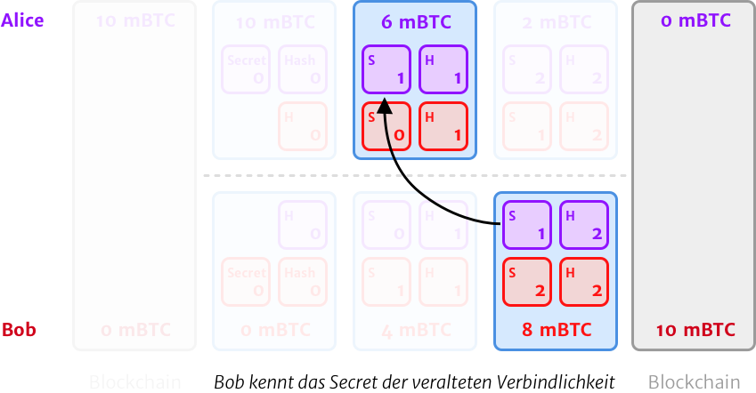

# Der Lebenszyklus eines Zahlungskanals im Lightning Netzwerk

Das Lightning Netzwerk baut auf der Bitcoin Blockchain auf und erweitert diese Basisebene mit dem Ziel der Skalierbarkeit:
Es ermöglicht schnellere Transaktionen und geringere Gebühren, die durch ein Netzwerk aus bidirektionalen Zahlungskanälen möglich werden.
Dieser Artikel erklärt dir den Aufbau und Lebenszyklus eines solchen Zahlungskanals.

Ein Zahlungskanal besteht jeweils zwischen zwei Parteien (bspw. zwischen Käufer und Verkäufer) und kann für beliebig viele Zahlungen unter ihnen genutzt werden.
In der Regel wird solch ein Kanal seitens der Partei erstellt, die regelmäßig Zahlungen an die andere Partei durchführen möchte.

Alles beginnt mit dem Abzweigen von der Blockchain in das Lightning Netzwerk bei der Erstellung eines Zahlungskanals.
Aus der Vogelperspektive lässt sich dies sehr einfach darstellen:

Sehen wir uns das Ganze im Detail an …

## Die Eröffnungstransaktion

==Bei der Eröffnung eines Zahlungskanals wird eine Multisignatur-Wallet für die beiden am Kanal beteiligten Parteien erzeugt.==
Diese Multisignatur-Wallet erstellt dabei drei Transaktionen, von denen jedoch vorerst nur eine — die *Eröffnungstransaktion* — auf der Blockchain veröffentlicht wird.

Die beiden weiteren Transaktionen werden als *Verbindlichkeitstransaktionen* bezeichnet und jeweils von den beiden Parteien einbehalten.
Diese Verbindlichkeitstransaktionen kann man sich wie eine laufend fortgeführte Abrechnungstabelle vorstellen.
Sie werden später bei der Kanalschließung genutzt, um den Zahlungsstand der beiden Kanalpartnern abzurechnen.
Eine oft genutzte Metapher dafür ist das Anschreiben lassen in einer Bar und das Bezahlen der Rechnung am Ende des Abends.

Visualisieren wir es mit dem folgenden Beispiel, in dem Alice einen Kanal mit 10 mBTC (10 Milli-Bitcoin, also 1 Millionen Sats) zu Bob eröffnet …

Beide Partei haben jeweils ein *Secret*, mit dem sie einen *Hash* für ihre Verbindlichkeitstransaktion generieren.
Der Hash wird untereinander ausgetauscht, das Secret behält vorerst jede Partei für sich.

Sobald die Eröffnungstransaktion genügend Bestätigungen hat, gilt der Zahlungskanal als offen und kann genutzt werden.

:::tip Zusatzinformation
Aktuell kann nur eine der beteiligten Parteien das Geld für die Eröffnung eines neuen Zahlungskanals bereitstellen.
Zukünftige Versionen der [Lightning Network Spezifikation](https://github.com/lightningnetwork/lightning-rfc) sehen aber das Öffnen von beidseitig finanzierten Kanälen vor.
:::

## Verbindlichkeitstransaktionen

Bob sendet Alice eine Rechnung über 4 mBTC, welche Alice daraufhin bezahlt.

==Im Zuge der Zahlung wird der neue Transaktionshash, sowie das vorherige Secret ausgetauscht.==
Das erhaltene Secret stellt für die Kanalpartner jeweils den Widerrufungsschlüssel dar.
Jede neue Verbindlichkeitstransaktion invalidiert die vorherigen, da das nun bekannte Secret dazu genutzt werden kann, die bisherigen Transaktionen des Zahlungskanals zu widerrufen.

Nach der ersten Transaktion innerhalb des Kanals, bei der sich die Verteilung der Beträge geändert hat, sieht der Stand von Alice's Verbindlichkeitstransaktion nun folgendermaßen aus:

- 4 mBTC für Bob und
- entweder: 6 mBTC für Alice nach 1000 Blöcken
- oder: 6 mBTC für Bob wenn er Alice's Secret kennt

Bob's Verbindlichkeitstransaktion ist das exakte Gegenteil zu Alice's Stand:

- 6 mBTC für Alice und
- entweder: 4 mBTC für Bob nach 1000 Blöcken
- oder: 4 mBTC für Alice wenn sie Bob's Secret kennt

Das macht Spaß – weiter geht's und wir sehen uns an, was es mit diesen magischen *1000 Blöcken Wartezeit* (etwa 7 Tage) auf sich hat …

Nach einer erneuten Zahlung über 4 mBTC von Alice an Bob sieht Alice's Stand so aus:

- 8 mBTC für Bob und
- entweder: 2 mBTC für Alice nach 1000 Blöcken
- oder: 2 mBTC für Bob wenn er Alice's Secret kennt

Die 1000 Blöcken Wartezeit werden nun interessant, wenn es zu einem der möglichen Szenarien der Kanalschließung kommt …

## Kanalschließung

Es gibt mehrere Möglichkeiten, wie es zu einer Kanalschließung im Lightning Netzwerk kommen kann.
Fangen wir mit dem einfachsten und üblichsten Szenario an …

### Kooperative Kanalschließung

Hierbei handelt es sich um den Idealfall, welcher in der Regel auch zustande kommt:
==Eine beidseitige und einvernehmliche Schließung, welche von beiden Kanalpartnern durch das Veröffentlichen ihrer jeweils aktuellen Verbindlichkeitstransaktion initiiert wird.==

Die Multisignatur-Wallet erzeugt ihre letzte Transaktion und zahlt den beiden Parteien ihre jeweils zustehenden Beträge wieder on-chain aus.
Beide Parteien sind glücklich und die Kanalschließung wird mit der Blockchain-Bestätigung der schließenden Transaktion vollzogen.

### Erzwungene Kanalschließung

Sagen wir Alice's Node verschwindet und Bob kann daher nicht den einvernehmlichen und kooperativen Weg gehen:
Er kann den Kanal nicht mehr nutzen und muss die Schließung seinerseits erzwingen, um sich seinen Teil der Verbindlichkeiten wieder on-chain auszahlen zu lassen.

In diesem Fall kommen die 1000 Blöcken Wartezeit (etwa 7 Tage) ins Spiel, die wiederum Alice die Chance geben, auf diese einseitig initiierte Schließung zu reagieren und sie ggf. zu widerrufen.

Kommt Alice in dieser Zeit nicht wieder online oder sie akzeptiert den von Bob veröffentlichten Stand, wird der Kanal nach 1000 Blöcken regulär geschlossen und die beiden Parteien bekommen on-chain ihre jeweiligen Beträge (auf Basis von Bob's Verbindlichkeitstransaktion) ausgezahlt.

Aber Moment …

### Was passiert wenn ein falscher Stand veröffentlicht wird?

Nehmen wir an Bob's Node verschwindet und Alice veröffentlicht einen veralteten Stand, welcher sie bevorteilt.
Dies kann entweder beabsichtigt vorkommen (das wäre gemein, um nicht zu sagen Betrug) oder versehentlich, bspw. durch das Wiederherstellen eines veralteten Stands aus einem Backup.

Die 1000 Blöcke Wartezeit geben Bob nun die Gelegenheit, seinerseits wieder online zu kommen und den von Alice veröffentlichten Stand zu widerrufen:
Er kennt und veröffentlicht dafür das Secret für Alice's veraltete Verbindlichkeitstransaktion und kann somit nachweisen, dass dies nicht die aktuellste Version ist.

Um eben solche Betrugsversuche zu unterbinden, setzt das Lightning Protokoll auf eine harte Strafe:
Wird ein solcher Fall von der benachteiligten Partei aufgedeckt, resultiert es in der Beschlagnahmung des kompletten Kanalbetrags.
In diesem Fall würde es bedeuten, dass die gesamten 10 mBTC an Bob gehen.

:::warning Warnung
Dabei ist es auch egal, ob Alice vorsätzlich oder versehentlich den veralteten Stand veröffentlicht hat —
hier gilt es also insbesondere bei der Datenmigration oder dem Einspielen von Backups aufzupassen!
:::

Ok, so viel zum Lebenslauf und den verschiedenen Zuständen eines Zahlungskanals.
Ich hoffe die Diagramme machen dieses eher technische Thema etwas zugänglicher.

Wenn dich das Ganze noch mal im Detail interessiert, kannst du dir [diese Folge der Pleb's Taverne](https://anchor.fm/plebs-taverne/episodes/TechTuesday---Lightning-Netzwerk-erklrt-e1kqf2b) anhören.
Dort erklären Cercatrova und Kid diese Aspekte ebenfalls und bieten auch weitere anschauliche Beispiele.
