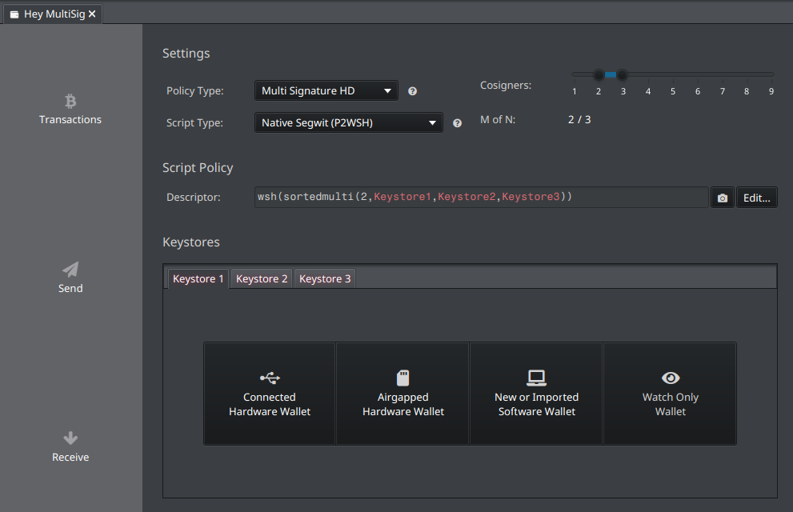
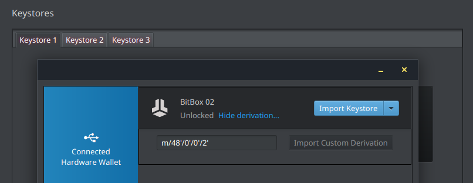
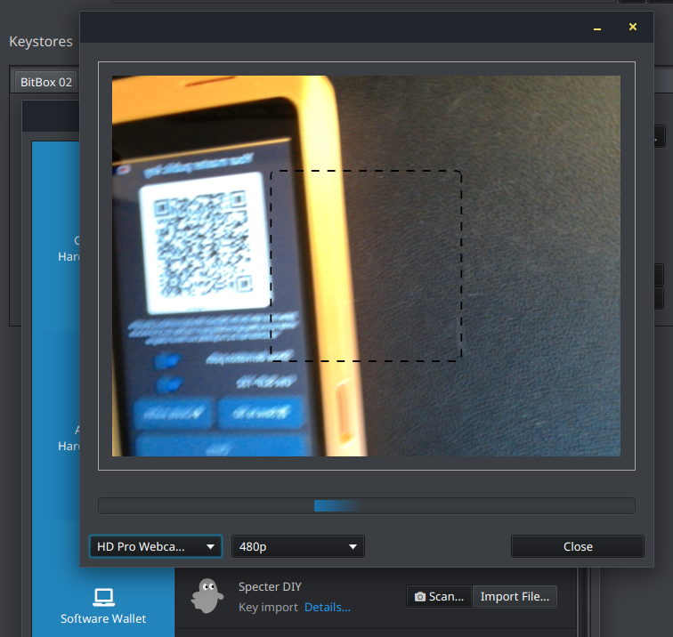
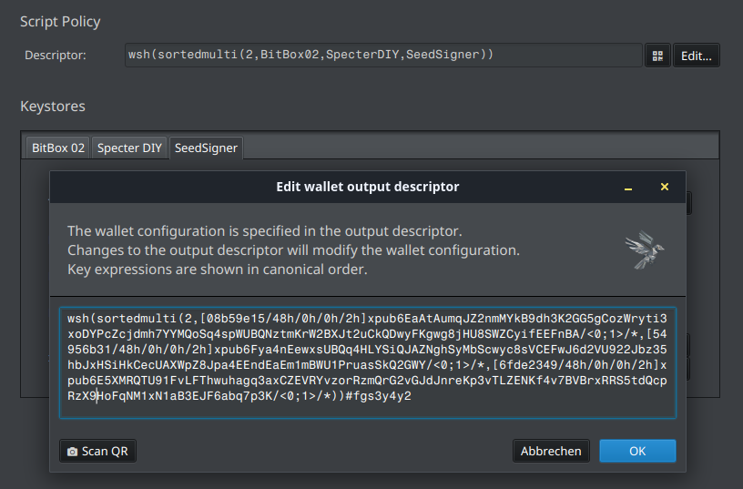

# MultiSig Teil 2: Praxis mit Sparrow

Der zweite Teil der Serie zeigt, wie ein 2-von-3-MultiSig-Setup mit [Sparrow Wallet](../sparrow-wallet/) in der Praxis aufgesetzt und genutzt wird.
Die Theorie findest du in [Teil 1 – Theorie und Konzepte](../multisig-bitcoin-wallet/).

## Vorbereitung

Bevor es losgeht, sollte dein Fundament stehen:

- **Sparrow Wallet** installiert: Die Einrichtung, das Importieren von Hardware-Wallets und die Grundbedienung sind in der [Sparrow-Anleitung](../sparrow-wallet/) beschrieben.
- **Eine eigene Bitcoin-Node**: Verbinde Sparrow mit ihr, wie unter [Bitcoin Fullnode mit der Wallet App verbinden](../bitcoin-fullnode-mit-wallet-verbinden/) erklärt.
  Über die Verbindung mit der eigenen Node sorgst du dafür, dass deine Adressen und Transaktionsdaten nicht an Dritte gelangen.
- **Eine Webcam**: SeedSigner und Specter-DIY kommunizieren air-gapped per QR-Code, und Sparrow liest diese Codes über die Webcam deines Rechners ein.

### Das Geräte-Set zusammenstellen

Für unser 2-von-3-Setup brauchst du drei unabhängige Keystores.
Passend zu den bisherigen Artikeln kannst du bspw. folgendes Setup wählen:

- **[SeedSigner](../seedsigner-hardware/)**: air-gapped per QR-Code, verwahrt seinen Seed als SeedQR.
- **[Specter-DIY](../specter-diy-hardware-wallet/)**: air-gapped per QR-Code, mit SmartCard oder SeedQR.
- **BitBox02**: klassische Hardware-Wallet, per USB und Pairing-Code angebunden.

Im weiteren Verlauf nehmen wir dieses Setup als Beispiel — natürlich kannst du es beliebig mit deinen Geräten variieren.
Wie im Theorie-Teil angesprochen: ==Mische Hersteller und Gerätetypen==, damit nicht ein gemeinsamer Firmware-Fehler gleich mehrere deiner Schlüssel trifft.

### Keystores anlegen

Bevor du neue Seeds erzeugst, bringe alle Geräte auf den aktuellen Stand und stelle sicher, dass die verwendete Software wirklich von den offiziellen Quellen stammt — die Anleitung [Software verifizieren](../software-verifizieren/) zeigt dir, wie.

**Jedes Gerät bekommt seine eigene, frisch generierte Seed-Phrase.**
Initialisiere sie unabhängig auf jedem Gerät und verwende niemals dieselbe Phrase doppelt.
Wie du eine neue Wallet sicher einrichtest, ist in [Bitcoin selber verwahren](../bitcoin-selber-verwahren/) Schritt für Schritt beschrieben.
Die jeweiligen Backups (Seeds und ggf. Passphrases) verwahrst du dabei am besten getrennt voneinander, an unterschiedlichen Orten.

:::tip Fingerprints notieren
Notiere dir beim Einrichten zu jedem Seed den **Fingerprint**, also den achtstelligen Code (bspw. `b16be191`), der jeden Seed eindeutig identifiziert.
Die Hardware-Wallets zeigen ihn dir in den Schlüsselinformationen an.
Der Fingerprint begleitet dich durchs ganze Setup:
Beim Import in Sparrow, beim Prüfen des Descriptors und beim Zuordnen deiner Backups.
:::

## Wallet in Sparrow erstellen

Jetzt fügen wir die drei Keystores in Sparrow zu einer gemeinsamen Wallet zusammen:

1. **Neue Wallet anlegen**: Über <kbd>File › New Wallet</kbd> vergibst du einen Namen, bspw. `Hey MultiSig`.
   Sparrow öffnet daraufhin direkt die Einstellungsseite der neuen Wallet.

2. **Policy festlegen**: Als Policy Type wählst du **Multi Signature HD** und stellst das **2-von-3-Quorum** ein.
   Beim Script Type bleibt es beim Standard **Native SegWit (P2WSH)**.

    

    Nun fügen wir mit jedem Gerät einen Keystore hinzu.
    Es wird dabei immer nur der **öffentliche** Schlüssel ausgetauscht — die privaten Schlüssel verlassen die Geräte nicht.

3. **Keystore 1 — BitBox02**:
    - Verbinde das Gerät per USB mit deinem Rechner und entsperre die BitBox.
    - Wähle <kbd>Connected Hardware Wallet</kbd> und klicke auf <kbd>Scan…</kbd>.
    - Mit <kbd>Import Keystore</kbd> liest Sparrow die Keystore-Daten über die Verbindung aus.
      Falls parallel die BitBox-App läuft, kann sie das Gerät exklusiv belegen — schließe die App und versuche es erneut, damit Sparrow die BitBox findet.

    

4. **Keystore 2 — Specter-DIY**:
    - Wähle <kbd>Airgapped Hardware Wallet</kbd> und klicke in der Liste der Importoptionen beim **Specter DIY**-Eintrag auf <kbd>Scan</kbd>.
      Sparrow öffnet daraufhin ein Webcam-Fenster.
    - Auf dem Specter wählst du <kbd>Master public keys › Multisig</kbd> und bekommst den QR-Code angezeigt, welchen du mit Sparrow scannen kannst.

    

    Sparrow ist zu schnell im Scannen, daher nur dieses verschwommene Bild eines Wegwerf-Seeds ;)

5. **Keystore 3 — SeedSigner**:
    - Wähle <kbd>Airgapped Hardware Wallet</kbd> und klicke in der Liste der Importoptionen beim **SeedSigner**-Eintrag auf <kbd>Scan</kbd>.
    - Auf dem SeedSigner wählst du <kbd>Seeds › Deinen Seed › Export xpub</kbd> und dort dann <kbd>Multisig › Native Segwit › Animated</kbd>.
      Du bekommst einen animierten QR-Code angezeigt, welchen du mit Sparrow scannen kannst, bis der Fortschrittsbalken voll ist.
    - Solltest du die oben genannten Optionen im SeedSigner-Menü nicht finden, sieh in den Einstellungen des SeedSigners nach:
      Unter <kbd>Settings › Advanced</kbd> aktivierst du unter <kbd>Sig types</kbd> die Signaturoption **Multisig** und unter <kbd>Script types</kbd> als Script-Typ **Native Segwit**.
      Damit exportiert der SeedSigner den MultiSig-xpub mit dem Ableitungspfad `m/48'/0'/0'/2'` statt eines Single-Sig-Schlüssels.
      :::tip Weitere Accounts
      Möchtest du später mehrere Account nutzen, musst du unter <kbd>Script types</kbd> ebenfalls **Custom Derivation** aktivieren.
      Beim Export kannst du dann anstatt **Native Segwit** die Option **Custom Derivation** wählen und den Ableitungspfad manuell eingeben (bspw. `m/48'/0'/1'/2'` für Account 1).
      :::

6. **Wallet überprüfen und sichern**:
    - Nun sind alle Keystores komplett. Prüfe für jeden Keystore die angezeigten Daten:
      Der Fingerprint muss zum jeweiligen Gerät passen, und alle drei Schlüssel sollten denselben Derivation Path `m/48'/0'/0'/2'` für P2WSH-MultiSig nutzen.
    - Klicke auf <kbd>Apply</kbd> und vergebe im Anschluss ein Wallet-Passwort, mit dem die Walletdatei verschlüsselt wird.

7. **Wallet-Backup erstellen**:
    - Den vollständigen **Descriptor** (`wsh(sortedmulti(2, …))`) samt aller xpubs findest du im Settings-Tab deiner Wallet.
      ==Er ist die Identität deiner Wallet und gehört in dein Backup!==
    - Neben dem Descriptor-Feld findest du einen QR-Code-Button (links neben <kbd>Edit…</kbd>), welcher ein neues Fenster mit dem Descriptor als QR-Code öffnet. Diesen wirst du im nächsten Schritt nutzen, um die MultiSig-Wallet auf die air-gapped Geräte zu bringen.
    - Wähle <kbd>Save PDF…</kbd> und speichere dir das Descriptor-PDF für dein Backup.
    - Zusätzlich solltest du dir den Descriptor ebenfalls über <kbd>Settings › Export</kbd> und dann jeweils <kbd>Output Descriptor › Export File…</kbd> und <kbd>Specter DIY › Export File…</kbd> sichern.

    

### Die Wallet auf die air-gapped Geräte bringen

SeedSigner und Specter brauchen die Wallet-Konfiguration, um MultiSig-Adressen zu prüfen und PSBTs zu signieren.
Der Seed allein genügt nicht, denn die gemeinsame Wallet entsteht erst aus dem Descriptor aller drei Schlüssel.

Im Settings-Tab findest du neben dem Descriptor-Feld einen QR-Code-Button (links neben <kbd>Edit…</kbd>), welcher ein neues Fenster mit dem Descriptor als QR-Code öffnet.
Scanne diesen Code auf deinen Geräten ein:

- Beim Specter-DIY über <kbd>Scan QR code</kbd>.
- Beim SeedSigner über das <kbd>Scan</kbd>-Menü.

Danach kennt jedes deiner air-gapped Geräte die gemeinsame Wallet.
Die BitBox02 erhält die Konfiguration automatisch über die USB-Verbindung.

## Erstempfang und Testbetrag

Bevor du nennenswerte Beträge einzahlst, verifiziere die Wallet gegenseitig:
Erzeuge im Receive-Tab eine Empfangsadresse und **prüfe sie auf jedem der drei Geräte**.
Die BitBox02 zeigt sie dir über <kbd>Display Address</kbd> direkt an; auf SeedSigner und Specter vergleichst du die Adresse innerhalb der jeweils geladenen Wallet.
Stimmen alle drei Anzeigen mit Sparrow überein, kennt jedes Gerät dieselbe Wallet.
Falsch importierte Schlüssel fliegen so auf, bevor Geld in der Wallet liegt.

Den Erstempfang spielst du sicherheitshalber mit einem kleinen Betrag durch:

1. Wechsle in Sparrow in den **Receive-Tab** und vergebe ein Label, bspw. `Testempfang`.
2. Prüfe die angezeigte Empfangsadresse auf allen drei Geräten, wie eben beschrieben.
3. Sende einen kleinen, für dich vertretbaren Testbetrag an die Adresse und warte eine Bestätigung ab.
4. Kontrolliere im Transactions-Tab, ob der Betrag sauber eingeht — und versende ihn im Anschluss testweise wieder (siehe nächster Schritt).

Erst wenn Empfang und Ausgabe des Tests funktioniert haben, kannst du größere Beträge einzahlen.

## Ausgeben – der PSBT-Workflow im Detail

Der zentrale Ablauf einer MultiSig-Ausgabe läuft über **PSBTs** (Partially Signed Bitcoin Transactions).
Sparrow bereitet die Transaktion vor, zwei der drei Geräte signieren sie. Der Ablauf im Detail:

1. **Transaktion vorbereiten**: Im Send-Tab trägst du Empfängeradresse, Label und Betrag ein und wählst die Gebühr.
   Möchtest du per [Coin Control](../utxo-management/) konkrete UTXOs ausgeben, selektiere sie vorher im UTXO-Tab (Mehrfachauswahl per <kbd>Ctrl</kbd>/<kbd>Cmd</kbd>+Klick) und nutze <kbd>Send Selected</kbd>.

2. **Transaktion erstellen**: Mit <kbd>Create Transaction</kbd> öffnet sich der Transaktions-Editor, in dem du Inputs und Outputs näher einsehen und prüfen kannst.

3. **Signaturbereich öffnen**: Der große Button <kbd>Finalize Transaction for Signing</kbd> schließt die Eingaben ab.
   Darunter erscheint der Signatures-Bereich mit dem Fortschritt der Signaturen (0 of 2).

4. **Erste Signatur einholen**:
   - **BitBox02 per USB**: Klicke auf <kbd>Sign</kbd>. Sparrow sendet die Transaktion an das Gerät, das dir die Details auf seinem Display zeigt. Prüfe dort Adresse und Betrag und bestätige.
   - **Air-gapped per QR**: Klicke auf <kbd>Show QR</kbd>, worauf Sparrow die PSBT als animierte QR-Folge anzeigt.
     Scanne sie mit dem Gerät (beim SeedSigner über das <kbd>Scan</kbd>-Menü), prüfe die Transaktionsdetails am Gerätedisplay und bestätige die Signatur.
     Das Gerät zeigt die signierte PSBT ebenfalls als QR-Animation.
     In Sparrow klickst du auf <kbd>Scan QR</kbd> und hältst das Gerät vor die Webcam.

     :::tip Das Gerätedisplay ist die Quelle der Wahrheit
      Prüfe Empfängeradresse und Betrag **auf dem Display des Signers**, nicht nur in Sparrow.
      Genau dafür haben die Geräte Bildschirme: Selbst ein kompromittierter Rechner kann dir dort nichts Falsches vormachen, denn das Gerät zeigt dir, was du tatsächlich signierst.
      :::
5. **Zweite Signatur einholen**: Wiederhole den Ablauf mit einem zweiten Gerät — per USB oder QR, je nachdem, welches Setup du gewählt hast.
   Sparrow erkennt, dass es sich um dieselbe Transaktion handelt, und führt die Signaturen zusammen; der Fortschritt steht nun bei 2 von 2 Signaturen.
6. **Senden**: Mit <kbd>Broadcast Transaction</kbd> verschickt Sparrow die fertige Transaktion über den verbundenen Server ins Netzwerk.

:::tip Hängt die Transaktion fest?
Sparrow aktiviert RBF (Replace-by-Fee) standardmäßig.
Sitzt deine Transaktion im Mempool fest, ersetzt du sie per Rechtsklick auf den Transaktionseintrag und <kbd>Increase Fee</kbd> durch eine höher bezahlte Variante.
Behalte dabei im Blick, dass MultiSig-Transaktionen wegen der mehreren Signaturen größer ausfallen als Einzelsignatur-Transaktionen — plane die Gebühren entsprechend.
:::

## Wiederherstellung üben

Die Wiederherstellung ist der Moment, in dem sich dein gesamtes Setup bewähren muss.
Genau deshalb ist **Übung Pflicht**, bevor größere Beträge in der Wallet landen — am besten durchspielst du gleich drei Szenarien:

### Szenario 1: Sparrow-Walletdatei weg

Festplatte kaputt oder Walletdatei versehentlich gelöscht — dein Guthaben bleibt davon unberührt, du baust nur die Watch-Only-Wallet neu auf:

- Öffne Sparrow und importiere über <kbd>File › Import Wallet › Descriptor</kbd> den Descriptor.
  Entweder scannst du den QR-Code aus deinem Setup-PDF ein oder du importierst die als Backup exportierte Output-Descriptor-Datei.
- Sparrow lädt Adressen und Transaktionen über deine Node, und du solltest dein Guthaben sofort wiedersehen.
- Alternativ spielst du ein Backup deiner Walletdatei (Endung `.mv.db` im Sparrow-Verzeichnis) zurück — mit dem Vorteil, dass es auch deine Labels enthält.

### Szenario 2: Ein Gerät wurde verloren

Nehmen wir an, die BitBox02 fällt ins Wasser oder du verlierst deine Specter SmartCard.
Die beiden anderen Schlüssel reichen zum Ausgeben, aber du willst das Quorum wiederherstellen:

- Stelle den Seed des verlorenen Geräts auf einem Ersatzgerät wieder her; aus der notierten Seed-Phrase oder per SeedQR.
- Importiere den Wallet-Descriptor auf deinem Ersatzgerät, damit es die MultiSig-Wallet kennt und Adressen prüfen sowie signieren kann.
- Signiere testweise eine kleine Transaktion mit dem Ersatzgerät und einem der beiden vorhandenen Geräte.
  Klappt das, ist dein Quorum vollständig wiederhergestellt.

### Szenario 3: Neuaufbau an einem anderen Rechner

Für den Fall, dass dein ganzer Rechner ausfällt:

- Richte Sparrow auf einem anderen System ein; bspw. frisch installiert oder als Live-System wie [Tails OS](../tails-os-sparrow-wallet/).
- Verbinde es mit deiner eigenen Node, importiere die Wallet aus dem Setup-PDF oder Descriptor-Backup und prüfe dein Guthaben.
- Bewege auch hier den Testbetrag einmal komplett, damit du weißt, dass jeder Schritt funktioniert.

Wenn alle drei Szenarien laufen, kennst du jeden relevanten Ernstfall aus der Übung und dein Backup funktioniert nachweislich.

## Best Practices und Fallstricke

- **Sparrow-MultiSig-Features nutzen**: Descriptor-Import und -Export, Wallet-Policies-Import (BSMS, BIP 388) sowie das **Wallet-Setup-PDF** erleichtern dir den Wechsel zwischen Geräten und das physische Backup ungemein. Nutze diese Werkzeuge aktiv.

- **Alle drei Geräte signieren lassen**: Auch wenn zwei Signaturen reichen — lass vor dem Einzahlen größerer Beträge einmal jedes der drei Geräte signieren.

  So merkst du sofort, wenn ein Signer ein Problem hat, statt es im Ernstfall zu erleben.
- **Labeling konsequent**: Vergib für jeden Empfang ein aussagekräftiges Label und nutze [Coin Control](../utxo-management/). Gerade bei einer MultiSig-Wallet ist Disziplin beim Labeling die Grundlage, um später zu verstehen, was woher kam und wohin es ging.

- **Walletdatei sichern**: Die Sparrow-Walletdateien (Endung `.mv.db`) enthalten deine xpubs und Labels. Sichere sie regelmäßig auf einem verschlüsselten USB-Stick.

- **Gebühren im Blick behalten**: MultiSig-Transaktionen sind größer als Einzelschlüssel-Transaktionen und kosten daher mehr Gebühr. Plane entsprechend und konsolidiere UTXOs in günstigen Phasen.

- **Schlüssel- und Geräteverteilung dokumentieren**: Halte fest, welcher Schlüssel auf welchem Gerät liegt, wo die Seeds liegen und wo der Descriptor — sinnvoll verschränkt mit [Seed Phrase Backup](../seed-phrase-backup/).

- **Fallstricke**: Verwechsle nicht die Geräte untereinander, achte auf unterschiedliche Ableitungspfade pro Account und prüfe den Fingerprint jedes Keystores.
