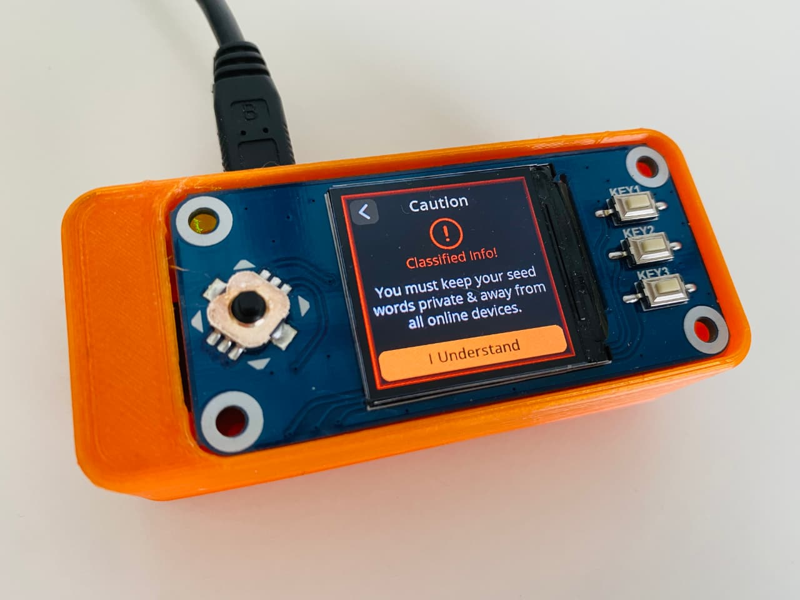
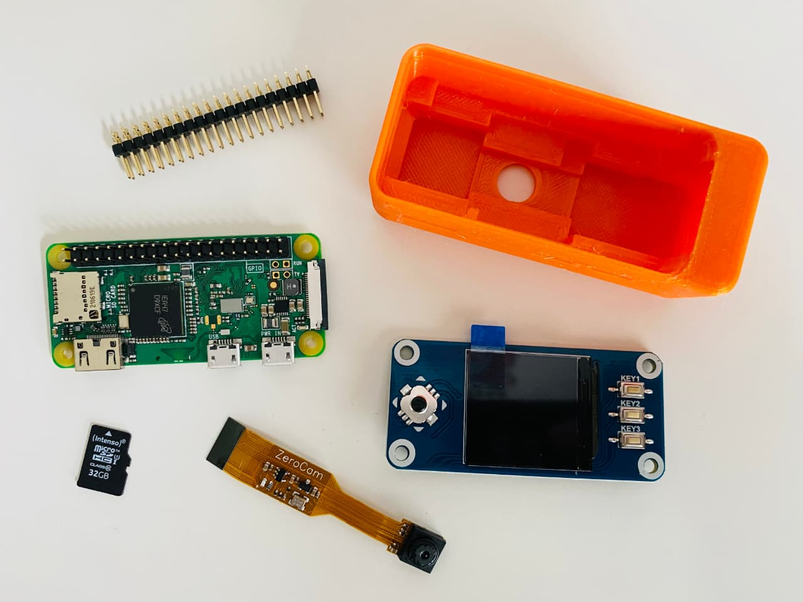

# SeedSigner: Der Bitcoin-Computer

Dieser Artikel erklärt dir den SeedSigner — warum dieses kleine Gerät sehr praktisch ist und welche Hardware-Komponenten du dafür brauchst.

## Was ist der SeedSigner?

Der [SeedSigner](https://seedsigner.com/) ist ein vielfältiger "Bitcoin-Computer", der komplett offline funktioniert und den man aus einfachen Standardkomponenten selber bauen kann.
Das kleine Signiergerät vereint viele Eigenschaften, die vor allem fortgeschrittene Bitcoiner sehr schätzen:

- Der SeedSigner kann **komplett offline und air-gapped** genutzt werden, was dem Thema Sicherheit zugute kommt.
- Die Interaktion mit externer Hard- und Software erfolgt über die **Kamera und QR-Codes**.
- Der SeedSigner kann bis zu drei Schlüssel gleichzeitig verwalten und eignet sich damit gut für die **Nutzung von MultiSig**.
- Hard- und Software sind **zustandslos** — das Gerät speichert nichts und vergisst sämtliche Daten, sobald es vom Strom getrennt wird.

Insbesondere diese Zustandslosigkeit unterscheidet das Gerät von den klassischen Hardware-Wallets:
Der SeedSigner ist kein Schlüsselspeicher, sondern ein reines Signiergerät, welches bei jedem Start neu initialisiert werden muss.
Daher spielen die Kamera und QR-Codes auch so eine große Rolle:
Jedes Mal den Seed neu eingeben wäre sehr mühsam; wenn sich der Seed aber relativ einfach extern speichern und laden lässt, ergibt sich ein Sicherheitsmodell, welches im Vergleich mit den klassischen Hardware-Wallets recht einzigartig ist. Dazu aber später mehr …

Darüber hinaus bietet der SeedSigner noch ein paar weitere, nennenswerte Eigenschaften:

- Bei guter Verfügbarkeit der Komponenten ist er **günstig selbst zu bauen**, die Kosten liegen bei etwa 50 Euro.
- Das Gerät wird aus **einfachen Standardkomponenten** gebaut, so kann auch beim Kauf der Einzelteile kein Bezug zum Thema Bitcoin hergestellt werden.
- Der SeedSigner bietet viele Funktionen zum Generieren und Verwalten von Seeds.
- Für Entwickler bietet das Gerät auch Testnet- und RegTest-Unterstützung.
- Die Software ist **quelloffen** und kann nach Belieben angepasst werden.
- Es gibt eine große Gemeinschaft von Leuten, die das Projekt betreut und weiterentwickelt.

## SeedSigner Hardware

Sehen wir uns die Einzelteile des SeedSigners näher an …

### Raspberry Pi Zero

Für den SeedSigner lassen sich die verschiedenen Raspberry Pi Zero Modelle nutzen — im Idealfall wählst du jedoch den **Raspberry Pi Zero v1.3**:
Dieser unterstützt im Gegensatz zu den anderen Varianten keine WiFi- und Bluetooth-Verbindungen.
Was zunächst wie ein Mangel klingt, ist in diesem Fall ein gewünschtes Feature:
Nur so lässt sich der SeedSigner verlässlich air-gapped und offline verwenden, da dies schon auf Hardware-Ebene gar nicht erst möglich ist.

Ein zu beachtender Punkt beim Raspberry Pi Zero v1.3 ist, dass dieser keine integrierte GPIO Headerleiste hat.
Diese wird jedoch für den Anschluß des Displays benötigt, was bedeutet, dass man für den Bau des SeedSigners zwei Wege wählen kann:

- Entweder man lötet eine [Standardstiftleiste](https://www.berrybase.de/stiftleiste-2x-20-polig-rm-2-54-gerade) auf das Board
- Oder man nimmt einen sogenannten [Hammer Header](https://www.berrybase.de/solderless-stiftleiste-2x-20-polig-rm-2-54-gerade) (findet man auch unter dem Begriff "GPIO Hammer"), dessen Stifte mit erweiterter Kontaktfläche in das Board gehämmert werden. Klingt komisch, funktioniert aber, wenn man feinfühlig ist und nicht den Vorschlaghammer nimmt. 😉

Die Alternativen dazu wären der Raspberry Pi Zero W (WLAN + Bluetooth, jedoch auch ohne Header) oder WH (WLAN + Bluetooth und integrierter Header).

:::tip Hinweis
Aktuell (Stand: Mitte 2022) sind leider alle Pi Zero Modelle recht schwer zu bekommen.

Setze am besten Verfügbarkeitsbenachrichtigungen bei Berrybase.de oder Welectron.com, um informiert zu werden, sobald es wieder Nachschub gibt.
:::

### Raspberry Pi Kamera

Die Mindestanforderung ist eine 5 Megapixel-Kamera mit 1080p und OV5647-Sensor.
Es gibt verschiedene Modelle — hier ist eigentlich nur drauf zu achten, dass die Kamera in das Gehäuse passt.
Ebenso muss das Flachbandkabel der Kamera mit dem Raspberry Pi Zero kompatibel sein.

Folgende Kameras lassen sich bspw. nutzen:

- [Kamera mit 15cm Flexkabel](https://amzn.to/3QD9aks)
- [Mini-Kamera mit kurzem Flexkabel](https://amzn.to/3bjMtln) (siehe Bild oben)

### Display mit 240×240-Pixel

Hier gibt es nicht viel Auswahl, du brauchst das [WaveShare 1,3-Zoll-LCD](https://www.waveshare.com/wiki/1.3inch_LCD_HAT).
Achte beim Kauf darauf, dass du das richtige Modell erwischst:
Du benötigst das Modell mit den 3 Buttons, einem Joystick und vor allem 240×240 Pixel Display.

:::warning
Es gibt weitere Varianten die ähnlich aussehen und ich habe mich auch schon vergriffen. 😬

Ein recht gleiches Modell ist bspw. mit 128×128 Pixeln:
Dies erkennt man äußerlich nur am weißen Rahmen des Displays.
**Nimm die 240×240 Pixel Variante.**
:::

### MicroSD-Karte

Hier reicht eine einfache MicroSD-Karte mit mindestens 4 GB Kapazität.
Nimm am besten gleich eine größere ab 16 GB, da der Preisunterschied nicht wirklich ins Gewicht fällt.

### Gehäuse

Du kannst den SeedSigner auch ohne Gehäuse nutzen, allerdings macht er in einem schicken Gewand doch mehr her und ist praktischer zu bedienen.

Hier gibt es verschiedenste Optionen und 3D-Druckvorlagen:

- Verschiedene Varianten der [offiziellen Cases](https://github.com/SeedSigner/seedsigner/tree/dev/enclosures)
- [Open Pill Faceplates + Digital Cross + Joystick + Pad](https://www.printables.com/en/model/179924-seedsigner-open-pill-cover-plates-digital-cross-jo/comments)
- [OrangeSurf](https://github.com/orangesurf/orangesurf-seedsigner-case)
- [Coverplate](https://cults3d.com/en/3d-model/various/seedsigner-coverplate-for-waveshare-1-3-inch-lcd-hat-with-240x240-pixel-display)
- [PS4 SeedSigner](https://www.thingiverse.com/thing:5363525) für die Gamer

Wenn du selbst keinen Zugang zu einem 3D-Drucker hast, kannst du über Anbieter wie [GoBrrr](https://www.gobrrr.me/shop/seedsigner/) oder [DIYnodes](https://diynodes.com/) auch fertig gedruckte Gehäuse beziehen.

:::tip Tipp
Bei diesen Anbietern kommst du ggf. auch an fertig zusammengebaute SeedSigner.
Dies kann eine Option sein, wenn du keine Lust auf selber basteln hast oder schlichtweg grade die Teile nicht zu bekommen sind.
:::

### Kosten

Abschließend noch einmal eine Auflistung der Komponenten und ihrer ungefähren Preise bei normaler Marktsituation:

- Raspberry Pi Zero v1.3: 6 EUR
- Pin-Leiste: 1 EUR
- Display: 15 EUR
- Kamera: 15 EUR
- SD-Karte: 10 EUR

Macht im günstigsten Fall also insgesamt etwas um die 50 Euro für die Hardware, zu denen dann noch das Gehäuse kommt.

Wenn du einen fertigen SeedSigner hast, kannst du direkt mir der Anleitung zur [SeedSigner Software und SeedQR](../seedsigner-software-seedqr/) weiter machen.
