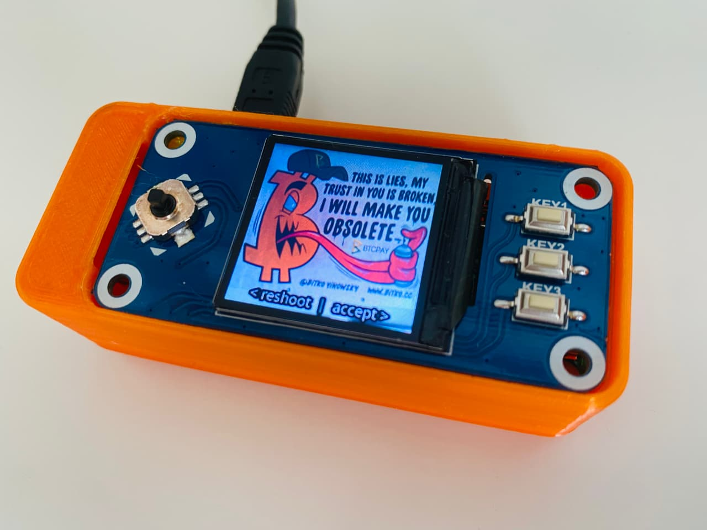
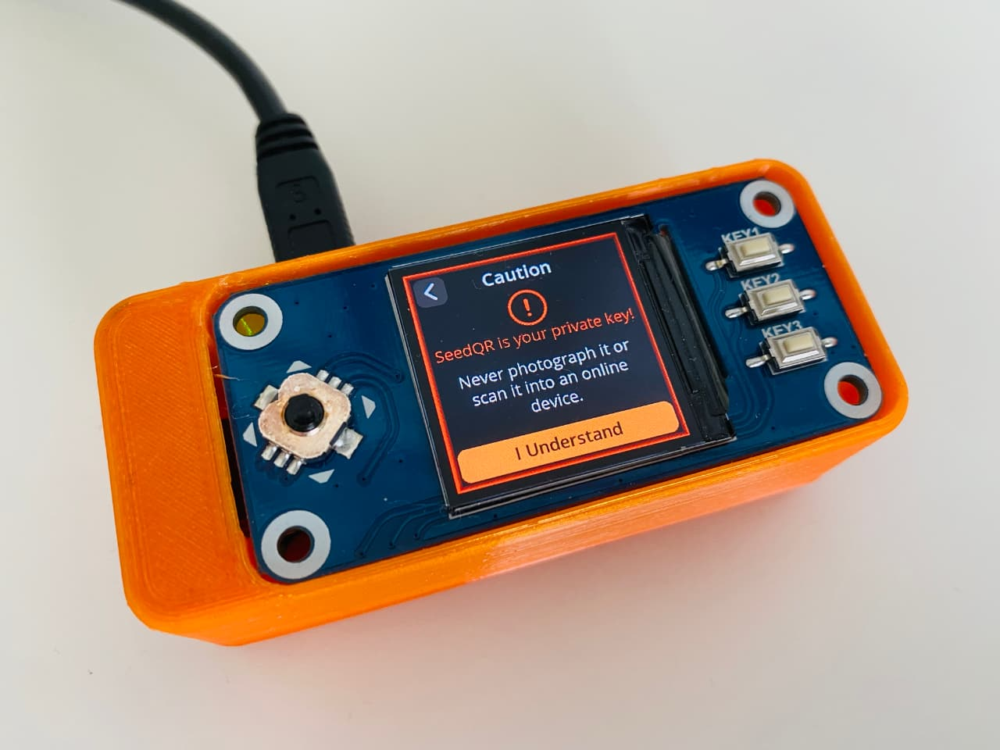
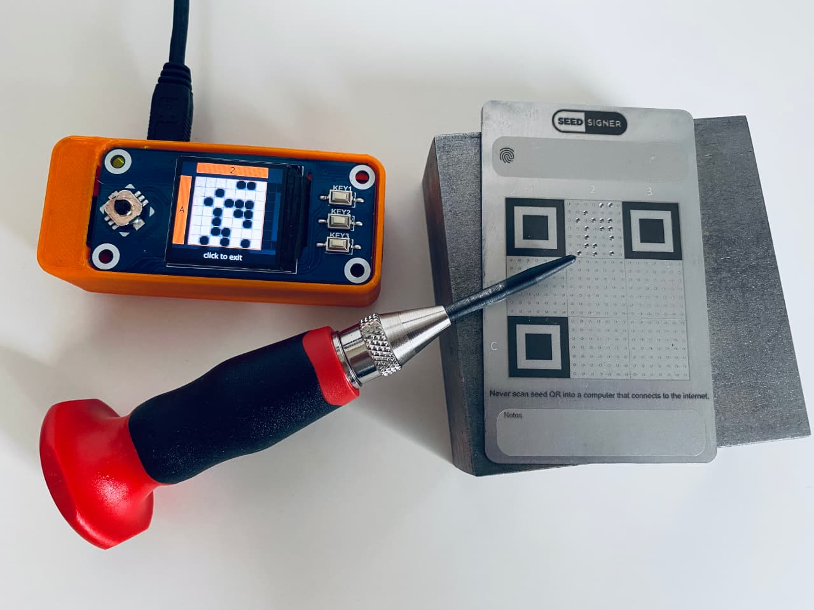
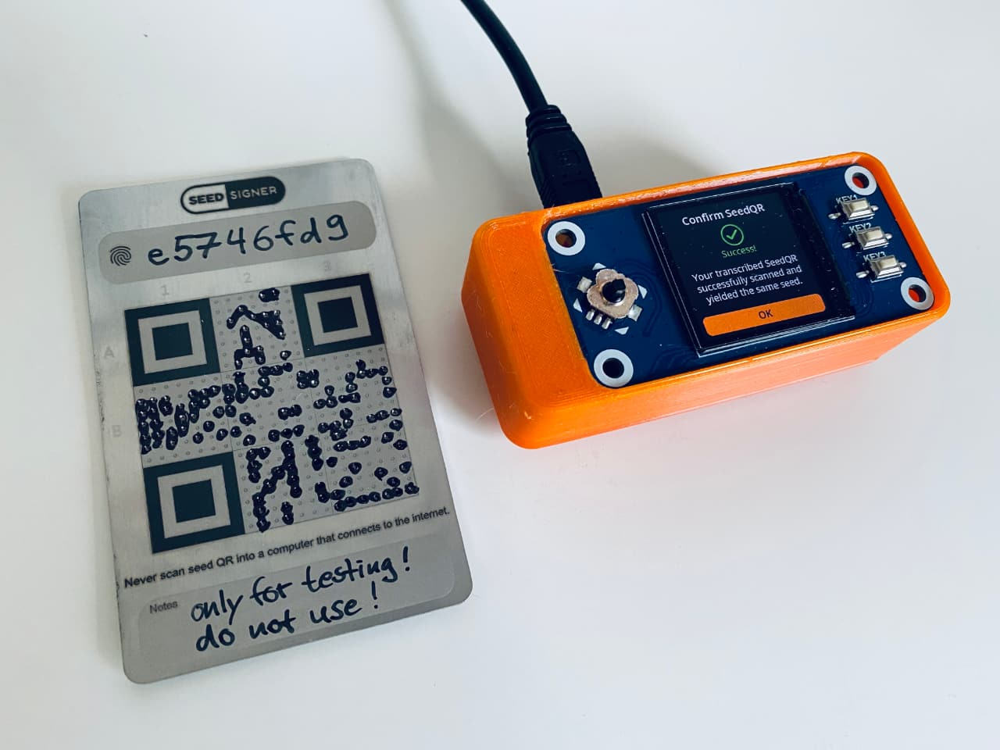
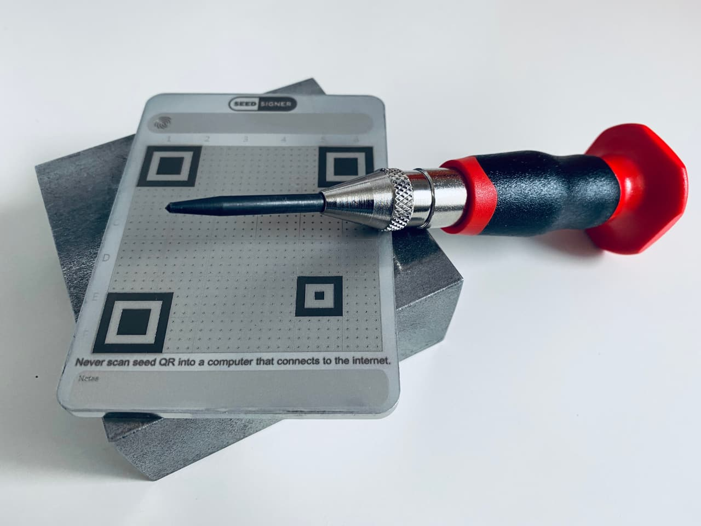
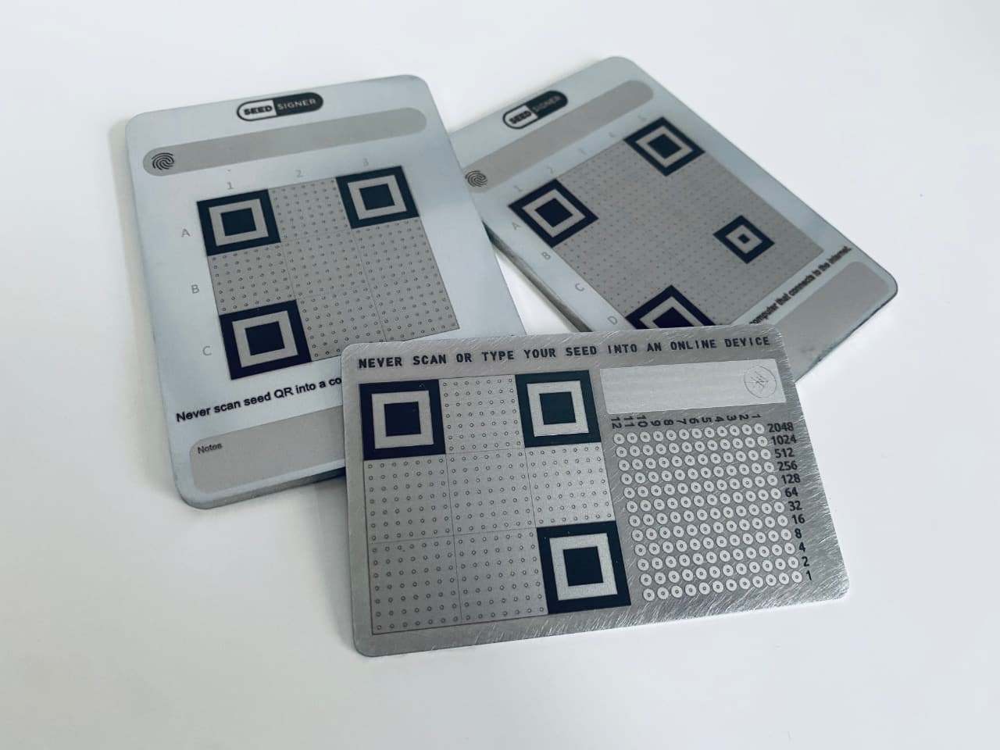

# SeedSigner: Software und SeedQR

Dieser Artikel gibt dir einen Überblick zur Verwendung des [SeedSigner](../seedsigner-hardware/)s — von der Installation der Software bis hin zur Nutzung der SeedQR-Codes.

## Installation der SeedSigner Software

Die Software kann über die [SeedSigner Releases](https://github.com/SeedSigner/seedsigner/releases/) auf GitHub bezogen werden.
Du lädst die aktuellste Version (hier `v0.5.1`, Stand: Mitte 2022) herunter und verifizierst die Software.
Eine genaue Beschreibung dazu und warum dieser Schritt wichtig ist, kannst du in der Anleitung zum [Software verifizieren](../software-verifizieren/) nachlesen.

Neben den `seedsigner_X_X_X.img` Dateien benötigst du den [SeedSigner PGP-Key](https://github.com/SeedSigner/seedsigner/blob/main/seedsigner_pubkey.gpg), den du ebenfalls von GitHub laden kannst.
Zur Bestätigung kannst du den PGP-Fingerprint des Keys mit diesem [Tweet](https://twitter.com/SeedSigner/status/1389617642286329856) abgleichen.

Sind diese Dateien alle heruntergeladen, kannst du die Software auf der Kommandozeile verifizieren:

```sh
# PGP-Key importieren, nur beim ersten Mal notwendig
gpg --import seedsigner_pubkey.gpg

# Echtheit der Hash-Datei mittels der Signatur verifizieren
gpg --verify seedsigner_0_5_1.img.zip.sha256.sig

# Hash der Zip-Datei abgleichen
shasum -a 256 -c seedsigner_0_5_1.img.zip.sha256
```

Dies sollte am Ende zu der Ausgabe `seedsigner_0_5_1.img.zip: OK` führen.

Wenn alles OK ist, kannst du das Image auf die MicroSD-Karte flashen (bspw. mit [Balena Etcher](https://www.balena.io/etcher/)).
Anschließend die MicroSD in den Raspberry Pi Zero einlegen und den Pi an den Strom anlegen, damit der SeedSigner startet.

### Überblick der Funktionen

- Seed generieren
- Backup Seedwords
- Fingerprint, Derivation Path und Passphrase notieren




## SeedQR: Ein spezielles Format





[Körner](https://amzn.to/3tPcAqq)

## SteelQR: Den Seed in Stahl transkribieren



- Vorstellung
- Körner/Center Punch und Permanent Marker
- Backup SeedQR
- SteelQR von [Vulcan21](https://vulcan21.com/steelqr/)



### Wallets mit Unterstützung

SeedQR-Kompatibilität

- Sparrow
- Specter
- BlueWallet
