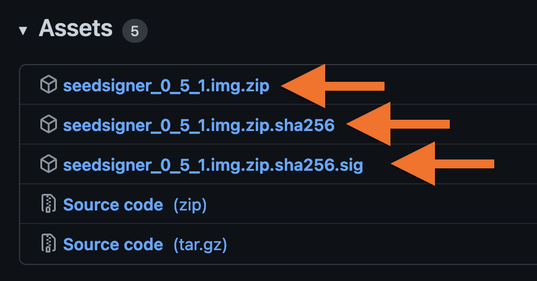

# SeedSigner: Software und SeedQR

Dieser Artikel gibt dir einen Überblick zur Verwendung des [SeedSigner](../seedsigner-hardware/)s — von der Installation der Software bis hin zur Nutzung der SeedQR-Codes.

## Installation der SeedSigner Software

Die Software kann über die [SeedSigner Releases](https://github.com/SeedSigner/seedsigner/releases/) auf GitHub bezogen werden.
Du lädst die aktuellste Version (hier `v0.5.1`, Stand: Mitte 2022) herunter und verifizierst die Software.
Eine genaue Beschreibung dazu und warum dieser Schritt wichtig ist, kannst du in der Anleitung zum [Software verifizieren](../software-verifizieren/) nachlesen.



Neben den `seedsigner_X_X_X.img` Dateien benötigst du dafür den [SeedSigner PGP-Key](https://github.com/SeedSigner/seedsigner/blob/main/seedsigner_pubkey.gpg), den du ebenfalls von GitHub laden kannst.
Zur Bestätigung kannst du den Fingerprint des Keys mit diesem [Tweet](https://twitter.com/SeedSigner/status/1389617642286329856) abgleichen.

Sind diese Dateien alle heruntergeladen, kannst du die Software auf der Kommandozeile verifizieren:

```sh
# PGP-Key importieren, nur beim ersten Mal notwendig
gpg --import seedsigner_pubkey.gpg

# Echtheit der Hash-Datei mittels der Signatur verifizieren
gpg --verify seedsigner_0_5_1.img.zip.sha256.sig

# Hash der Zip-Datei abgleichen
sha256sum --check seedsigner_0_5_1.img.zip.sha256
```

Dies sollte am Ende zu der Ausgabe `seedsigner_0_5_1.img.zip: OK` führen.

Wenn alles OK ist, kannst du das Image auf die MicroSD-Karte flashen (bspw. mit [Balena Etcher](https://www.balena.io/etcher/)).
Anschließend die MicroSD in den Raspberry Pi Zero einlegen und den Pi an den Strom anlegen, damit der SeedSigner startet.

### Überblick der Funktionen

Die Software braucht etwa 20 Sekunden zum Booten und du findest dich nach kurzer Ansicht des Startbildschirms im Menü wieder.
Dort hast du Zugriff auf die Hauptbereiche der Software:

#### Scan

Einen bestehenden Seed oder auch eine Transaktion (wird im PSBT-Format von deiner Software-Wallet bereitgestellt) als QR-Code einscannen.

#### Seeds

Hier kannst du 12 oder 24 Wort-Seeds manuell eingeben oder dir einen neuen Seed generieren.
Für letzteres gibt es weitere Optionen, um dem Generierungsprozess eigene Enthropie hinzuzufügen:

- Du kannst [Würfel werfen](https://github.com/SeedSigner/seedsigner/blob/dev/docs/dice_verification.md) (50× für 12 Wörter, 99× für 24 Wörter)
- Oder mit der Kamera ein Foto machen, dessen Pixel als Zufallsinput genommen werden


#### Tools

Neben dem direkten Einstieg zu den Optionen der Seedgenerierung findest du hier auch ein Tool um für einen bestehenden Seed das zwölfte bzw. 24. Wort auszurechnen
Dies kann zur Überprüfung von Seeds genutzt werden.

#### Settings

In den Einstellungen hast du die Möglcihkeit, sämtliche Funktionen anzupassen:

- Welches Bitcoin Netzwerk wird für die Keys verwendet: Mainnet, Testnet oder RegTest
- Einstellungen zur QR-Code Qualität und Kameraausrichtung
- Verschiedene Signaturoptionen (Single- oder MiltiSig) und Script-Typen (Segwit, Taproot, etc.)
- Passphrase: Soll die Option verfügbar oder gar erforderlich sein
- SeedQR Kompaktformat (siehe unten)

In einer der kommenden Versionen wird die Software mehrsprachig und ist dann auch auf deutsch verfügbar.
Ggf. werde ich dann auch einen Durchlauf der Funktionen als Video hier bereitstellen.
So lassen sich die Seedgenerierung und das Signieren von Transaktionen besser als In Textform zeigen.

## SeedQR: Der private Schlüssel als QR-Code

Wie in der Anleitung zur [SeedSigner Hardware](../seedsigner-hardware/) beschrieben, macht die Nutzung des SeedSigners erst in Kombination mit dem SeedQR-Format richtig Sinn:
Jedes Mal den Seed als Wortfolge neu eingeben ist sehr mühsam, daher sollte er als QR-Code in Papierform oder besser noch auf eine Stahlplatte eingestanzt abgelegt werden.

Mittels [SeedQR](https://github.com/SeedSigner/seedsigner/tree/dev/docs/seed_qr) lässt sich der [private Schlüssel](/glossar/#private-key-und-seed-phrase) als QR-Code abbilden.
Dabei gibt es zwei Formate:

- Das Standardformat ist eine einfache Repräsentation deiner 12 bzw. 24 Seed-Wörter, die sich auch direkt mit einem QR-Code Leser auslesen lassen.
- Das **CompactSeedQR** Format enthält ebenfalls den Seed, allerdings im Binärformat. Dadurch sind die Daten nicht direkt menschenlesbar und auch etwas platzsparender kodiert.

Letzteres kann zum einen als zusätzliches Sicherheitsmerkmal gesehen werden, zum anderen kannst du dieses Format aber auch schneller auf Papier oder Stahl übertragen, weil es eine geringere Datenmenge (und somit QR-Code Punkte) hat.

Generell lässt sich sagen, dass das Kompaktformat damit eigentlich die erstrebenswerte Variante ist —
dennoch kommt dies auch mit einem Warnhinweis daher:
Da es sich um ein spezielles Format handelt, kann es nur vom SeedSigner und kompatibler Software eingelesen werden.
Dies spielt für die [Wiederherstellung](https://github.com/SeedSigner/seedsigner/blob/dev/docs/recovery.md) eine wichtige Rolle.

Wallets mit Unterstützung für das kompakte SeedQR-Format sind aktuell:

- BlueWallet
- Nunchuk
- Sparrow
- Specter Desktop

<br>

:::danger Wichtig
Egal welches der Formate du nutzt:
**Der SeedQR ist dein privater Schlüssel.**
Bewahre ihn so sicher und für Fremde unzugänglich auf, wie deine Seed-Wörter.


:::

## SteelQR: Den Seed in Stahl transkribieren

Das Sichern von Seeds auf Stahl ist eine beliebte Möglichkeit, den privaten Schlüssel auch im Brandfall abzusichern.
Um passend zum SeedSigner auch direkt den SeedQR auf Stahl zu transkribieren, hat [Satsnick](https://twitter.com/snicktoshi) passende Stahlplatten entwickelt, die sich als [SteelQR im Vulcan21-Shop](https://vulcan21.com/steelqr/) finden.

Es gibt dabei verschiedene Optionen, welche sich je nach Seed-Länge (12 oder 24 Wörter) und SeedQR-Format eignen:

- Die **C12 Onboarding-Card** ist eine dünne und kleine Variante, die eher zum Ausprobieren und Testen gedacht ist. Sie fasst einen 12 Wort-Seed im Kompaktformat. **C12 Full Backup** ist quasi der große Bruder, der von die langfristige Speicherung gedacht ist.
- Die **CS124** Variante ist das Multitalent: Hier passen sowohl 12 als auch 24-Wort Seed im Standard- und Kompaktformat.
- Und **S24** ist für 24-Wort Seeds im Standardformat gedacht ­— sie hat die gleiche Größe wie die CS124-Karte, erlaubt aber ein größeres QR-Code Format.


Um den Seed auf die Stahlplatte zu übertragen benötigst du einen [Körner](https://amzn.to/3tPcAqq).
Das Werkzeug gibt es als manuelle und automatische Variante:

- Manuell: Du musst mit einem Hammer auf das Ende schlagen.
- Automatisch: Der Körner stanzt mittels Druckfeder eigenständig.

Die automatische Variante (siehe Foto) ist meiner Meinung nach definitiv ihr Geld wert, da sich damit wesentlich präziser und bequemer arbeiten lässt.

A propos präzise arbeiten: Solltest du beim Einstanzen einen Fehler machen, ist nicht gleich alles verloren.
Das QR-Format hat eine Fehlertoleranz von 7%, so dass je nach SeedQR-Format auch ein wenig daneben gehen darf.


Der SeedSigner stellt dir wie im Foto zu sehen hoch aufgelöst dar, wie die einzelnen Quadranten zu stanzen sind.
Auf dem Bild siehst du die **C12 Onboarding-Card**, welche ich für einen Test-Seed verwendet habe um den Prozess zu zeigen.

Du solltest dir beim ersten Mal etwas Zeit zum Üben nehmen, um dich mit dem Körner vertraut zu machen.
Für mich war dies auch das erste Mal, dass ich mit einem automatischen Körner gearbeitet habe —
beim Vulcan21-Shop bekommst du bei deiner Bestellung auch eine Karte zum Üben dazu, was sehr praktisch ist.

Je nach Format kann auch das Körnern etwas dauern: Für einen 24-Wort Seed ist man schon etwa 45 Minuten dabei, schließlich will man trotz der Fehlertoleranz  alles richtig machen und es soll anschließend ja auch gut aussehen. 🤩


Theoretisch und bei passender Beleuchtung reichen die gekörnerten Löcher aus, um anschließend auch direkt per SeedSigner den SteelQR zu verifizieren.
Meiner praktischen Erfahrung nach ist es jedoch hilfreich, die Punkte mit einem Permanent Marker nachzumarkieren.
Dies hilft beim Einlesen des SeedQR sehr, um auch unabhängiger von den Lichtverhältnissen zu sein.

Auf den SteelQR-Karten kannst du noch zusätzlich den Fingerprint sowie Notizen vermerken.
Ich hab dies hier ebenfalls mit dem Permanent Marker gemacht —
für den Praxiseinsatz solltest du dies am besten auch mit Schlagbuchstaben machen, damit auch sie ein Feuer überstehen.

## Weitere Links

Wenn du dich darüber hinaus für weitere Aspekte interessierst, sieh dir den [Einundzwanzig Stammtisch zum SeedSigner](https://www.youtube.com/watch?v=xMUEBTzTM6U) an.
Es gibt ebenso einen sehr guten [Artikel zum SeesdSigner im Bitcoin Magazine](https://bitcoinmagazine.com/guides/how-to-use-seedsigner-for-secure-bitcoin), dieser ist allerdings auf englisch.
