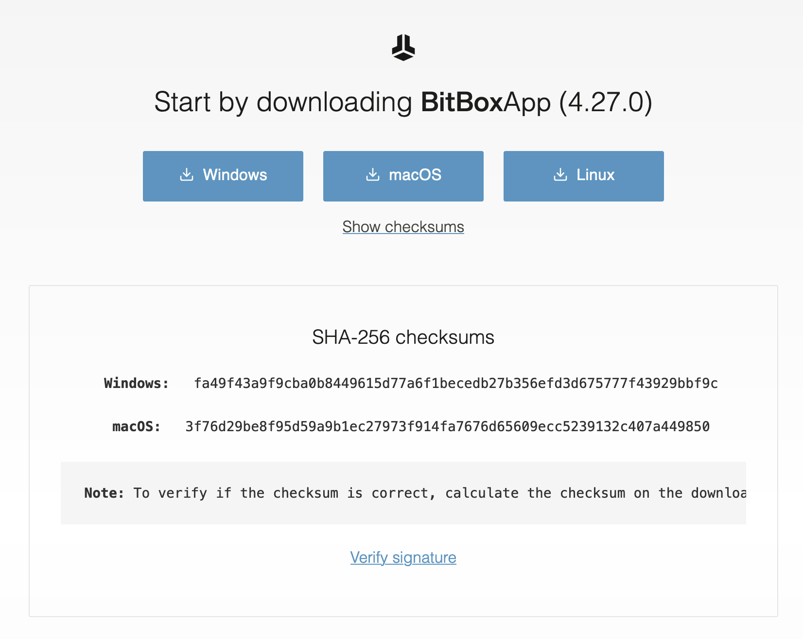
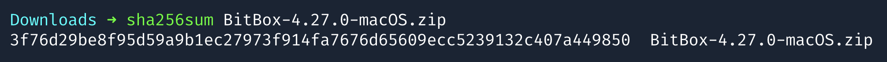
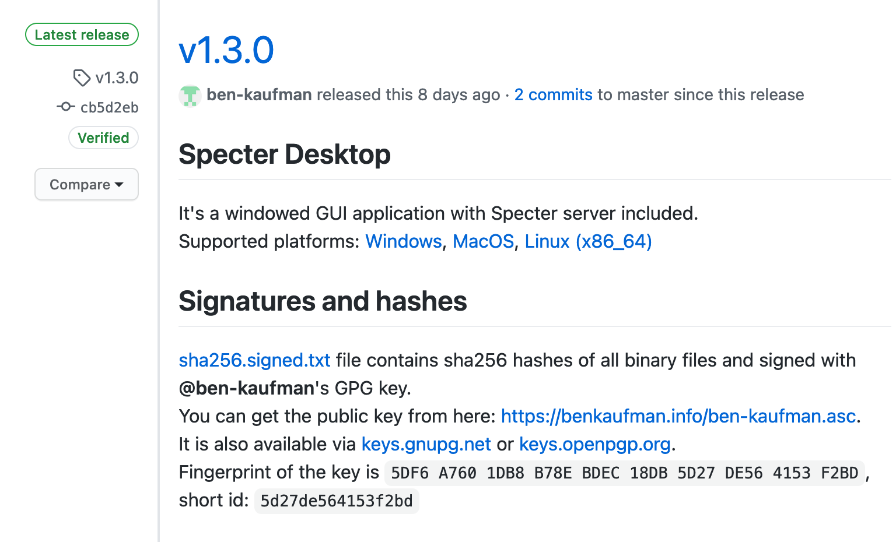
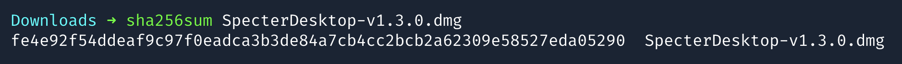
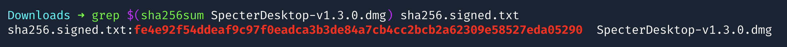

# Software verifizieren

## Was und warum?

Die meisten seriösen Webseiten, auf denen du Bitcoin-bezogene Software herunterladen kannst, weisen dich drauf hin, den Download zu verifizieren.
Dies ist wichtig um sicherzustellen, dass du auch wirklich die vom Hersteller angebotene Software installierst.

Es gibt einige potentielle Möglichkeiten, mit denen Angreifer dir eine schadhafte Software-Version unterschieben können.
Herkömmlicherweise werden die meisten dieser Angriffsszenarien durch die App Stores von Apple, Google, Microsoft, etc. überprüft.
Bitcoin-bezogene Software wird oftmals jedoch außerhalb dieser zentralen Plattformen angeboten, was bspw. Vorteile in der Zensurresistenz hat.
Indem du prüfst, dass die Software von der richtigen Website heruntergeladen wurde und sie anschließend verifizierst, schützt du dich weitestgehend vor Angreifern.

Auch wenn es auf den ersten Blick recht technisch erscheint, solltest du dich mit den folgenden Schritten vertraut machen.
Das Verifizieren der Software gehört zu jeder Installation und jedem Update dazu – Kontrolle geht über Vertrauen, schließlich geht es um dein Geld.

## Wie verifiziere ich Software?

Vorraussetzung ist die Software **GPG**, die du für dein Betriebssystem installieren musst:

- Windows: [Gpg4win](https://gpg4win.org/download.html)
- macOS: [GPGTools](https://gpgtools.org/)
- Linux: [GnuPG](https://gnupg.org/download/index.html)

Bevor wir loslegen noch ein paar Begriffe, die du während des Vorgangs gebrauchen wirst:

- **Private Key**: Der private Schlüssel, mit dem der Software-Hersteller die Datei signiert. Nur der Hersteller hat diesen Schlüssel und er kann damit öffentlich einsehbare Signaturen erstellen.
- **Signature**: Öffentlich zugängliche Information, mit der sichergestellt werden kann, dass sie vom Besitzer eines bestimmten privaten Schlüssels erstellt wurde.
- **Public Key**: Dieser Schlüssel ist das öffentliche Gegenstück zum privaten Schlüssel, mit denen die Allgemeinheit die Signatur des Herstellers überprüfen kann.
- **Checksum**: Prüfsumme, die den Dateiinhalt kryptografisch beschreibt. Ändert sich der Dateiinhalt auch nur im geringsten, dann erhält man auch eine andere Prüfsumme.
- **SHA256**: Die kryptografische Funktion, mit der die Prüfsumme erstellt wird. Sie wird mit dem Dateinamen der zu überprüfenden Datei aufgerufen. Die Funktion liefert unabhängig vom Betriebssystem bei gleichem Dateiinhalt immer das gleiche Ergebnis.

Der Ablauf ist dabei immer gleich:

0. Öffentlichen Schlüssel des Herstellers herunterladen und importieren: Dies ist nur beim ersten Mal  nötig (oder bei Änderungen des Schlüssels). Im Idealfall bezieht man den öffentlichen Schlüssel vom Hersteller direkt und unabhängig von der Software-Downloadseite.
1. Software-Datei herunterladen
2. Prüfsumme erstellen und vergleichen
3. Signatur-Datei herunterladen
4. Signatur der Software-Datei verifizieren

Je nach Betriebssystem und GPG-Software kannst du einzelne Teilschritte der Verifizierung auch in der grafischen Benutzeroberfläche machen.
Den vollständigen Weg gehen wir im folgenden aber auf der Kommandozeile durch – keine Angst, es ist einfacher als es zunächst klingt. 😉

## Beispiel: BitBox App

Sehen wir uns den Vorgang am Beispiel der [BitBox App](https://bitbox.swiss/download/) (hier Version 4.27.0) an:
Zusätzlich zu den Download-Buttons siehst du die *Checksums* für die jeweiligen Dateien.



### Schritt 1: Prüfsumme vergleichen

Du lädst die Datei für dein Betriebssystem hinunter und öffnest den Download-Orner in der Kommandozeile.
Mit dem Befehl `sha256sum` und dem Dateinamen kannst du die Prüfsumme erstellen und sie dann mit der Angabe auf der Website vergleichen:



Die Prüfsumme stimmt – das ist schon mal ein guter erster Schritt.

::: tip HINWEIS
Bis hierhin kann die Sache aber immer noch einen Haken haben:
Hat ein Angreifer die Download-Seite kompromitiert, wäre es ihm wahrscheinlich sehr leicht möglich, neben der Datei auch die Prüfsumme auszutauschen.
Daher sollte nicht nur die Prüfsumme, sondern auch die Signatur der heruntergeladenen Datei gecheckt werden!
:::

### Schritt 2: Signatur überprüfen

Die meisten Hersteller bieten dir auf ihrer Download-Seite eine Anleitung zum Verifizieren der Signatur an. So auch ShiftCrypto auf der GitHub-Seite zum jeweiligen Release, die du über den [Verify Signature](https://github.com/digitalbitbox/bitbox-wallet-app/releases/tag/v4.27.0)-Link erreichst.

Solltest du den öffentlichen Schlüssel für die ShiftCrypto Software-Releases noch nicht importiert haben, dann kannst du ihn von Keybase herunterladen: Keybase ist eine Website auf der Leute ihre öffentlichen Schlüssel abgelegen können – in diesem Fall ist es der [Public Key von Marko Bencun](https://keybase.io/benma/pgp_keys.asc?fingerprint=2260e48288882c76afaa319d67a2b160f74db275), der für ShiftCrypto die Software-Releases signiert.

```bash
# Public Key herunterladen
curl https://keybase.io/benma/pgp_keys.asc?fingerprint=2260e48288882c76afaa319d67a2b160f74db275 > benma.asc

# Public Key importieren
gpg --import benma.asc
```

Dies muss nun ebenfalls für die Signatur der Download-Datei geschehen:
Zuerst laden wir die Signatur herunter, um sie anschließend zu überprüfen.

Der Signatur-Dateiname entspricht dem der Software – sie hat zusätzlich die Namensendung `.asc`.
Beachte auch, dass die Signaturdatei im gleichen Ordner wie die Software gespeichert werden muss.

```bash
# Signatur herunterladen
curl https://github.com/digitalbitbox/bitbox-wallet-app/releases/download/v4.27.0/BitBox-4.27.0-macOS.zip.asc > BitBox-4.27.0-macOS.zip.asc

# Signatur überprüfen
gpg --verify BitBox-4.27.0-macOS.zip.asc
```

Im Erfolgsfall solltest du folgendes sehen:

```
gpg: Signature made <DATE AND TIME>
gpg:                using RSA key 2D8876810AB092E451DCA894804538928C37EAE8
gpg: Good signature from "Marko Bencun <marko@shiftcrypto.ch>" [unknown]
gpg:                 aka "Marko Bencun <mbencun+pgp@gmail.com>" [unknown]
gpg: WARNING: This key is not certified with a trusted signature!
gpg:          There is no indication that the signature belongs to the owner.
Primary key fingerprint: 2260 E482 8888 2C76 AFAA  319D 67A2 B160 F74D B275
     Subkey fingerprint: 2D88 7681 0AB0 92E4 51DC  A894 8045 3892 8C37 EAE8
```

Wichtig ist dabei der Teil `Good signature from "Marko Bencun <marko@shiftcrypto.ch>"`.
Die Warnung und der Zusatz `[unknown]` erscheinen, da der Schlüssel in GPG unbestätigt ist.
Dies wäre ein zusätzlicher Schritt, bei dem du bestätigst, dass du diesen Schlüssel auch sicher vom Hersteller direkt bekommen hast.
Die Software kann unabhängig davon installiert werden, da du nun sichergestellt hast, dass sie vom Hersteller signiert wurde.

::: warning ACHTUNG
Sollte die Meldung `Good signature` nicht erscheinen, dann handelt es sich um einen fehlerhaften Download und du solltest die Software nicht installieren.
In dem Fall solltest du dich direkt an den Hersteller wenden und auf dieses Problem aufmerksam machen.
:::

## Beispiel: Specter Desktop App

Weil es so viel Spaß macht, das Ganze nun auch noch mal für die [Specter Desktop App](https://github.com/cryptoadvance/specter-desktop/releases/tag/v1.3.0) (Version 1.3.0).
Die Downloads werden hier direkt auf GitHub angeboten, das Vorgehen ist aber relativ gleich.



Die Specter-Downloads werden mit [Ben Kaufman's Public Key](https://benkaufman.info/ben-kaufman.asc) signiert, den du direkt bei Ben auf der Website herunterladen kannst:

```bash
# Public Key herunterladen
curl https://benkaufman.info/ben-kaufman.asc > ben-kaufman.asc

# Public Key importieren
gpg --import ben-kaufman.asc
```

Auch hier ist es gut zu sehen, dass der öffentliche Schlüssel nicht Teil des gleichen GitHub Repositories ist, sondern von einer separaten Website geladen werden muss:
Wäre das Repository kompromitiert, wäre es leicht ebenso auch den Key auszutauschen.
Stattdessen müssten in diesem Fall sowohl das Repository als auch Ben's Website gehackt werden.

### Prüfsumme und Signatur überprüfen

Du lädst die Software für dein Betriebssystem herunter, damit du die Prüfsumme erstellen kannst:



Da Specter pro Release verschiedenste Dateien veröffentlicht, werden die Prüfsummen und Signaturdateien nicht einzeln angeboten.
Stattdessen werden sie alle gesammelt in der Datei [sha256.signed.txt](https://github.com/cryptoadvance/specter-desktop/releases/download/v1.3.0/sha256.signed.txt) zusammengefasst.
Diese Datei ist mit Ben Kaufman's Schlüssel signiert, so dass mit der Überprüfung der Signatur die Korrektheit der darin enthaltenen Prüfsummen sichergestellt werden kann.

```bash
# Signierte Prüfsummendatei herunterladen
curl https://github.com/cryptoadvance/specter-desktop/releases/download/v1.3.0/sha256.signed.txt > sha256.signed.txt

# Signatur überprüfen
gpg --verify sha256.signed.txt
```

Im Erfolgsfall sollte die Meldung folgendermaßen aussehen:

```
gpg: Signature made <DATE AND TIME>
gpg:                using RSA key 277F910FF06DC7619A71C1F67DC93B9A38A23CB2
gpg: Good signature from "Ben Kaufman <ben.kaufman10@gmail.com>" [unknown]
gpg: WARNING: This key is not certified with a trusted signature!
gpg:          There is no indication that the signature belongs to the owner.
Primary key fingerprint: 5DF6 A760 1DB8 B78E BDEC  18DB 5D27 DE56 4153 F2BD
     Subkey fingerprint: 277F 910F F06D C761 9A71  C1F6 7DC9 3B9A 38A2 3CB2
```

Wenn du `Good signature` siehst, dann kannst du auch hier wieder von einer validen Signatur ausgehen.

Nun muss nur noch die Prüfsumme gecheckt werden:
Dies geht indem du in der signierten Datei nach dem Ergebnis der `sha256sum` Funktion suchst …

```bash
grep $(sha256sum SpecterDesktop-v1.3.0.dmg) sha256.signed.txt
```

Wenn du die Zeile mit der Prüfsumme siehst ist alles gut:



Bekommst du keine Ausgabe oder einen Fehler zu sehen, dann ist die Prüfsumme nicht in der signierten Datei vorhanden.
In dem Fall solltest du im Specter Desktop Repository ein Issue anlegen und auf das Problem hinweisen.
