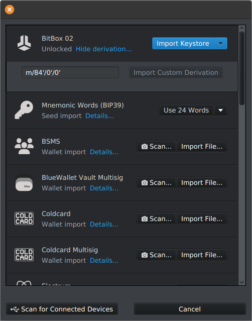

# Sparrow Wallet: Dein Tool für Selbstverwahrung & Privatsphäre

[Sparrow Wallet](https://sparrowwallet.com/) ist die professionelle Wahl für Bitcoin-Selbstverwahrung und bietet exzellente Features für professionelles [UTXO-Management](../utxo-management/).
Dieser Artikel erklärt dir die Einrichtung mit Hardware Wallets, fortgeschrittenes UTXO-Management und wie du maximale Privatsphäre mit deiner [eigenen Bitcoin-Node](../bitcoin-fullnode/) erreichst.

## Warum Sparrow Wallet?

Wenn du die [Grundlagen der Bitcoin-Selbstverwahrung](../bitcoin-wallet-grundlagen/) verinnerlicht hast und nun nach einer Wallet suchst, die dir maximale Kontrolle, Privatsphäre und Transparenz bietet, dann ist Sparrow Wallet genau die richtige Wahl.

Sparrow ist zwar **nicht** die typische "Einstieger-Wallet" für absolute Beginner, aber das umfangreiche Featureset ist die Auseinandersetzung damit wert.
Sparrow Wallet richtet sich an Nutzer, die:

- Sicherheitsbewusst sind und Wert auf Selbstverwahrung legen
- Privatsphäre aktiv schützen möchten
- Die Vorteile einer eigenen Bitcoin-Node nutzen wollen
- Fortgeschrittene Features wie Coin Control und Multi-Sig schätzen
- Bereit sind, sich in eine professionelle Oberfläche einzuarbeiten

Im Vergleich zu anderen Desktop-Wallets zeichnet sich Sparrow durch mehrere entscheidende Merkmale aus:

- Bitcoin-only: Sparrow konzentriert sich ausschließlich auf Bitcoin - keine anderen Kryptowährungen, maximaler Sicherheitsfokus.
- Privacy by design: Integrierter Tor-Support, Coin Control Tools und nahtlose Integration mit der eigenen Node verhindern Datenlecks.
- Open Source & Transparenz: Der Code ist für jeden einsehbar und überprüfbar - keine Hintertüren, keine Überraschungen.
- Professionelle Features: Von Airgapped-Signierung über Multi-Sig bis hin zu erweiterten Scripting-Möglichkeiten — Sparrow wächst mit deinen Anforderungen.

## Installation

Bevor wir uns mit den Features beschäftigen, sorgieren wir für die sichere Installation, denn Download & Verifikation sind die ersten kritische Schritte:

- [Lade Sparrow Wallet](https://sparrowwallet.com/download/) nur von der offiziellen Downloadseite herunter, niemals von Drittanbietern oder App-Stores!
- [Verifiziere die heruntergeladenen Dateien](../software-verifizieren/) und stelle sicher, dass die Software nicht manipuliert wurde.

Verifikations-Schritte:

1. Lade neben der Installationsdatei auch die Manifest- und .asc-Signaturdatei herunter
2. Importiere den Sparrow-PGP-Schlüssel wie [in der Dokumentation beschrieben](https://sparrowwallet.com/download/#earlier-releases)
3. Verifiziere, dass die Signatur mit dem offiziellen Schlüssel übereinstimmt und zu der Downloaddatei für dein Betriebssystem passt

Wenn du diese Schritte erfolgreich abgeschlossen hast, kannst du Sparrow Wallet öffnen und nutzen.

:::tip Sehr praktisch
Von hier an kannst du auch Sparrow zum Verifizieren von Downloads nutzen:
Seit der Version 1.8.3 findest du im Sparrow Menü unter <kbd>Tools › Verify Download</kbd> eine grafische Oberfläche, mit der du die Verifikations-Schritte auch mit jeder weiteren Software (nicht nur Sparrow) durchführen kannst.
:::

## Grundsetup

Bevor du deine erste Wallet erstellst, konfigurieren wir Sparrow für maximale Privatsphäre und Souveränität.
Diese Einstellungen sind die Grundlage für ein sicheres Setup.
Unter <kbd>File › Settings</kbd> findest du die Einstellungen deiner Verbindung zur Bitcoin-Welt und bestimmst, wie Sparrow die Blockchain-Daten bezieht.

Im <kbd>General</kbd> Tab findest du als wichtigste Konfigurationsmöglichkeit die "Fee rate source" (zur Gebührenschätzung) und den "Block Explorer" (Anzeigen von Transaktionsdetails).
Du kannst dabei das öffentliche [Mempool.space](https://mempool.space/de/) nutzen — oder im Idealfall auf deine eigene Instanz dieser Open Source-Software zurückgreifen.
Der Vorteil deiner eigenen Mempool-Instanz ist auch hier wieder Privatsphäre:
Abfragen zu Transaktionsdetails oder Gebührendaten finden lokal in deinem Netzwerk statt und sind für Mempool.space nicht mit deiner IP verknüpfbar.

Im <kbd>Server</kbd> Tab geht es um die Anbindung des Bitcoin-Nodes, von dem Sparrow die Blockchain-Daten bezieht:

- Option 1 ist ein Public Server, welchen du nur im Ausnahmefall nutzen solltest, wenn du keinen eigenen Node zur Verfügung hast:
  Die Nutzung eines öffentlichen Servers setzt Vertrauen zu dessen Anbieter voraus und bietet die geringste Privatsphäre.
  Deine IP und Wallet-Daten werden an einen Drittanbieter gesendet.

- Option 2 und 3 sind für die Anbindung deines eigenen Nodes gedacht:
  Hier hast du die Wahl zwischen der einfachen RPC-Verbindung direkt zu deinem Bitcoin Core Prozesss (Option 2) — oder noch besser einem privaten Electrum-Server (Option 3).
  Letzteres erlaubt dir einen Indexer wie Electrs oder Fulcrum anzufragen, was wesentlich performanter als die Bitcoin Core Verbindung ist.

  Die gängigen Fullnode-Projekte wie StartOS, Raspiblitz und Umbrel unterstützen jeweils auch einen oder mehrere dieser Indexer.
  Dort in den Einstellungen findest du auch die jeweiligen Details, welche du für die Verbindung zu Sparrow benötigst.

Diese Konfiguration stellt sicher, dass du von Anfang an die Kontrolle über deine finanziellen Daten behältst und keine dieser Informationen an Dritte gehen.
Jetzt können wir mit dem Import deiner Wallet beginnen.

## Wallet-Erstellung: Importieren deiner Hardware-Wallet

Unter dem Menüpunkt <kbd>File › Import Wallet</kbd> findest du diverse Möglichkeiten, eine bestehende Wallet anzubinden.
Wir gehen dabei von Anfang an den sichersten Weg und importieren nur die öffentlichen Schlüssel deiner Hardware-Wallet, nicht die privaten Schlüssel.
Dies wird als "Watch-Only Wallet" bezeichnet und ist einer der größten Sicherheitsvorteile von Sparrow.

:::tip Was ist eine Watch-Only Wallet?

- Nur der öffentliche Schlüssel (xpub/extended public key) wird in Sparrow gespeichert
- Deine privaten Schlüssel verbleiben sicher auf der Hardware-Wallet
- Sparrow kann Empfangsadressen generieren und Transaktionen vorbereiten
- Zum Signieren musst du immer deine Hardware-Wallet verbinden
:::

Warum dieser Ansatz sicherer ist:

- Kein Risiko durch Malware: Selbst wenn dein Computer kompromittiert wird, könnten Angreifer nur deine öffentlichen Adressen sehen, nicht deine privaten Schlüssel stehlen
- Bequemlichkeit und Sicherheit: Du kannst dein Guthaben jederzeit überwachen, benötigst die Hardware-Wallet nur zum Senden
- Datensparsamkeit: Sparrow bekommt von deiner Hardware-Wallet nur das Nötigste, um mit der Hardware-Wallet zu interagieren

### Schritt-für-Schritt Anleitung

1. Hardware-Wallet vorbereiten: Schließe deine Hardware-Wallet an (ColdCard, BitBox, etc.) an und entsperre sie mit deiner PIN
2. Wähle im Import-Fenster die Option <kbd>Scan for Connected Devices</kbd>
3. Entsperre deine Wallet, woraufhin sie im Import-Fenster als erste Option auftaucht:

   
4. Klicke auf <kbd>Import Keystore</kbd> und vergebe einen Namen und ein Passwort für die Wallet.
   Letzteres ist optional, du solltest aber ein Passwort vergeben, da Sparrow dieses zur Verschlüsselung der auf dem Computer gespeicherten Walletdaten nutzt.
5. Sparrow liest nun den öffentlichen Schlüssel (xpub) von deinem Gerät aus und läd damit vom konfigurierten Node die damit verbundenen Transaktionsdaten.

Deine Wallet erscheint jetzt als neuer Tab und in der linken Seitenleiste findest du nun alle Möglichkeiten, um mit der Wallet zu interagieren.

## Die Features im Detail: Von Basics zu Fortgeschritten

Nachdem Sparrow installiert und deine Hardware-Wallet als Watch-Only Wallet importiert ist, werfen wir einen genaueren Blick auf die einzelnen Bereiche und ihre Funktionen.

### Wallet Settings: Die Grundkonfiguration deiner Wallet

Fangen wir mit dem letzten Tab in der Seitenleiste an, den Wallet-Einstellungen.
Hier sind die wichtigsten Optionen:

- **Policy Settings**: Zeigt den Script Type (Native SegWit, Taproot, etc.) und Fingerprint, sowie vollständigen Descriptor deiner Hardware-Wallet an.
  Diese Informationen sind insbesondere dann wichtig, wenn du deine Wallet auch mit weiteren Tools wie bspw. BTCPay Server nutzt.

- **Multi-Account Unterstützung**: Über den Button <kbd>Add Account…</kbd> kannst du Unterkonten für deine Wallet erstellen. Wie im Artikel zu den [Wallet Grundlagen](../bitcoin-wallet-grundlagen/) erklärt, kannst du dieses Feature nutzen, um unterschiedliche Zwecke (z.B. "Hauptdepot", "Tägliche Ausgaben", "KYC-Coins") voneinander zu trennen.

Unter <kbd>Advanced</kbd> findest du die [Gap Limit](/glossar/#gap-limit) Option, welche relevant wird, wenn du nach einem Wallet-Import nicht alle erwarteten Transaktionen sehen solltest.

### Transaktionen: Der detaillierte Blick auf deine Wallethistorie

Hier siehst du alle deine ein- und ausgehenden Transaktionen in chronologischer Reihenfolge.
In der Übersichtsliste hast du auch direkt die Option, Transaktionen zu labeln.

Über der Transaktionstabelle findest du neben der Anzahl Transaktionen auch einen Button for den CSV-Export der Transaktionen:
Du kannst ihn nutzen, um deine Transaktionshistorie bspw. für Steuerzwecke oder eigene Analysen in anderen programmen zu exportieren.

:::tip Labels exportieren und sichern
Der CSV-Export enthält **nicht** deine Labels in strukturierter Form (BIP 329).
Wenn du deine Labels mit anderen Anwendungen austauschen oder unabhängig von deiner Sparrow Wallet-Datei sichern möchtest, kannst du dazu den Menüpunkt <kbd>File › Export Wallet › Labels</kbd> nutzen.
:::

Durch das Aufklappen einer Transaktionszeile siehst du auch die in ihr verwendeten UTXOs und kannst diese einzeln labeln.
Ebenso hast du die Möglichkeit durch einen Klick auf die Lupe noch weiter einzusteigen und dir sämtliche Transaktionsdetails anzeigen zu lassen.

Dort wird dir bspw. der UTXO-Fluss mit den Inputs und Outputs visualisiert.
Es lohnt sich diesen Bereich näher zu erkunden, denn Sparrow stellt die technischen Details gut dar und man kann intuitiv sehen, wie eine Bitcoin-Transaktion aufgebaut ist.

### Senden

Oberflächlich simpel, aber mit mehreren erweiterten Optionen, beispielsweise:

- **Mehrere Empfänger angeben**: Du kannst in einer Transaktion Zahlungen an mehrere Parteien tätigen, um Gebühren zu sparen.
  Solltest du dieses Feature nutzen, achte dabei darauf, dass jeder Empfänger auch die anderen in dieser Transaktion enthaltenen Zahlungen sehen könnte.

- **Labeling**: Vergib direkt eine kurze Beschreibung für deine eigenen Aufzeichnungen.
- **Gebühren-Einstellungen**: Hier gibt dir Sparrow mehrere gut visualisierte Tools, um die passende Gebühr zu bestimmen.
  Du kannst die Gebühr entweder selber festlegen oder anhand von Transaktionspriorität und Mempool-Zustand bestimmen lassen.
  Für letzteres werden die im Grundsetup gewählten Einstellungen genutzt.
- **Coin Selection Strategien**: Sofern du nicht manuell UTXOs für eine Transaktion auswählst (dazu kommen wir im UTXO-Tab), kannst du mittels der `Optimize`-Option wählen, ob Sparrow automatisch nach folgenden Kriterien wählt:
  - <kbd>Efficiency</kbd>: Minimiert die Transaktionsgröße und optimiert auf niedrigere Gebühren
  - <kbd>Privacy</kbd>: Führt eine sogenannte [Stonewall-Transaktion](https://sparrowwallet.com/docs/spending-privately.html#fake-two-person-coinjoin) aus, welche die Privatsphäre optimiert, aber durch das Enthalten mehrerer UTXOs zusätzliche Gebühr kostet

### Empfangen

Hier kannst du neue Empfangsadressen generieren und direkt labeln.
Dieser Tab ist recht simpel und intuitiv, daher gehen wir nur auf folgendes Feature ein:
Über den Button <kbd>Display Address</kbd> hast die Möglichkeit, dir die angezeigte Empfangsadresse auf deiner Hardware-Wallet bestätigen zu lassen:

- Verbinde dazu deine Hardware-Wallet und klicke <kbd>Scan</kbd>
- Du solltest nun deine Wallet sehen und den Button <kbd>Display Address</kbd> nutzen können:

  
- Vergleiche die in Sparrow angezeigte Adresse mit der auf deinem Hardware-Wallet-Display.
  Dies dient als Schutz vor Malware, die Empfangsadressen manipulieren könnte.

### Adressen & UTXOs: Die Werkzeuge für fortgeschrittenes Management

Diese beiden Tabs funktionieren recht ähnlich und bieten dir zusätzliche Management-Optionen.

- Adressen: Hier bekommst du eine Übersicht deiner Empfangs und Wechselgeld-Adressen.
  Du siehst, welche Adressen bereits genutzt wurden und kannst die Listen filtern und exportieren.
- UTXOs: Hier kannst du deine UTXOs nach Datum, Größe, oder Labels filtern.
  Ebenso kannst du bestimmte UTXOs "freezen", so dass sie nicht für die automatische Auswahl beim Senden berücksichtigt werden.

Der UTXO-Tab ist vor allem relevant, wenn du UTXOs manuell für eine Transaktion auswählen möchtest (Coin Control).
Sehen wir uns das anhand von zwei Beispielen an …

#### Beispiel 1: Coin Control

Nehmen wir an, du möchtest eine Zahlung tätigen und bestimmte UTXOs verwenden, um nicht unbewusst Coins zu vermischen.
Du gehst dafür folgendermaßen vor:

- Gehe zum UTXO-Tab und wähle anhand deiner Labels die gewünschten UTXOs aus, die zusammen den benötigten Betrag ergeben.
- Während der Auswahl siehst du im Button <kbd>Send Selected</kbd> auch den zusammengenommenen Betrag der ausgewählten UTXOs.
- Nutze den Button, um die Transaktion nur mit den gewählten UTXOs durchzuführen.

#### Beispiel 2: UTXO-Konsolidierung (Aufräumen)

Nehmen wir an, du möchtest viele kleine UTXOs zusammenfassen, um zukünftig Gebühren zu sparen.
Du gehst dafür folgendermaßen vor:

- Warte auf eine Phase mit niedrigen Netzwerkgebühren.
- Sortiere im UTXO-Tab alle UTXOs nach ihrem `Value`.
- Wähle die kleinen UTXOs aus, die du konsolidieren möchtest.
- Sende sie an eine deiner eigenen frischen Empfangsadressen: Mittels <kbd>Send Selected</kbd> landest du im Send-Tab.
  Dort findest du am rechten Rand des Empfangsfeldes einen Pfeil, den du nutzen kann, um mit der Option <kbd>Walletname - Deposit</kbd> eine neue deiner eigenen Adressen generieren zu lassen.
- Durch das Absenden der Transaktion bekommst du nach der Bestätigung ein großes UTXO, anstelle von vielen kleinen.

## Fazit und Best Practices

Diese Übersicht gibt dir das Rüstzeug, um Sparrow effektiv zu nutzen.
Schließen wir das Ganze mit ein paar Sicherheitsempfehlungen ab:

- Sichere deine Sparrow-Walletdateien: Diese Dateien (je Wallet mit der Endung `.mv.db` im Sparrow-Wallet-Verzeichnis) enthalten deine öffentlichen Schlüssel und Labels. Ein Backup dieser Dateien erspart dir die erneute Einrichtung aller Konten, Labels und Einstellungen, falls deine Festplatte kaputt geht. Sichere sie regelmäßig auf einem verschlüsselten USB-Stick.
- Regelmäßige Updates: Sparrow ist aktive Software, die kontinuierlich verbessert wird. Verfolge neue Versions-Releases, so dass du über Sicherheitsupdates informiert bleibst. Verifiziere auch bei neue Versionen immer die PGP-Signatur — du kannst dies nun auch direkt in Sparrow über den Menüpunk <kbd>Tools › Verify Download</kbd> machen.
- Verwende Labels konsequent: Man kann nicht genug betonen, wie wichtig dieses Feature sowohl für die eigene Buchführung als auch den Schutz deiner Privatsphäre ist. Sparrow macht es sehr einfach, Labels zu vergeben — nutze das zu deinem Vorteil.

In kommenden Artikeln tauchen wir noch tiefer in fortgeschrittene Features wie Multi-Sig, Airgapped-Handling und PSBTs (Partially Signed Bitcoin Transactions) ein.
