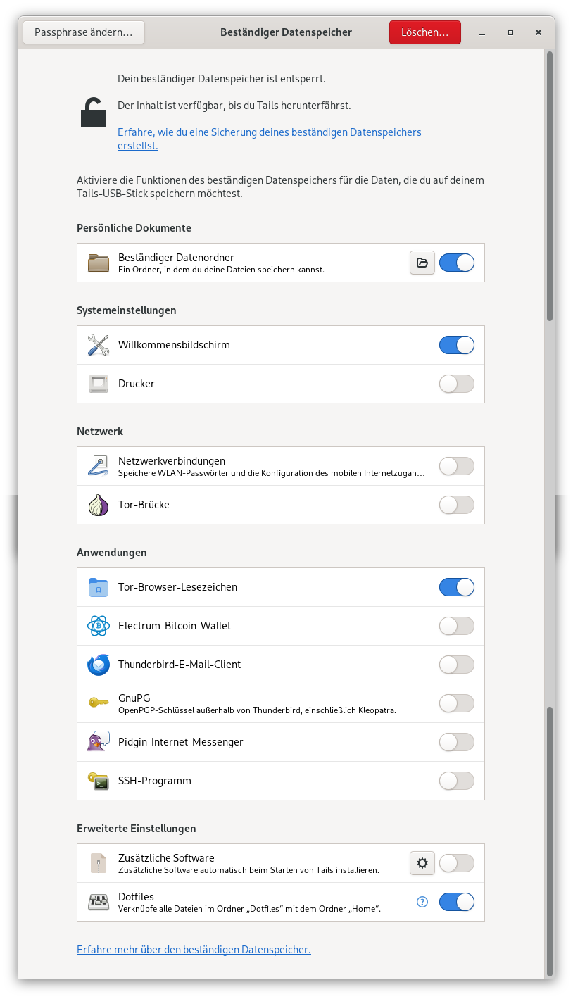

# Tails OS: Sparrow Wallet installieren und nutzen

Das Grundprinzip von [Tails OS](../tails-os-privatsphaere-betriebssystem/) ist radikal und wirkungsvoll: Amnesie.
Nach jeder Sitzung verschwinden alle Spuren deiner Aktivitäten — eine entscheidende Sicherheitsfunktion, die digitale Forensik praktisch unmöglich macht.
Doch dieser Ansatz steht im Konflikt mit einer praktischen Notwendigkeit vieler Bitcoin-Nutzer:
Der Arbeit mit [Sparrow Wallet](../sparrow-wallet/), die Konfiguration und Daten benötigt.

## Das Persistenz-Paradoxon: Warum Ausnahmen Sinn machen können

Die allgemeine Empfehlung, **keine Persistenz auf Tails zu verwenden**, ist in den meisten Fällen absolut richtig. Doch es gibt einen speziellen Anwendungsfall, bei dem kontrollierte Persistenz akzeptabel ist: **Watch-only Wallets**.

Bei einer Watch-only Wallet werden **ausschließlich öffentliche Schlüssel (xPub/zPub)** gespeichert, die:
1. Keine Gefahr bei Kompromittierung darstellen (da sie keine Transaktionen autorisieren können)
2. Das mühsame Neuscannen der Blockchain bei jedem Start vermeiden
3. Die Arbeitsumgebung mit Labels und Transaktionsnotizen erhalten

### Kritische Einschränkung: Nur für Watch-only geeignet

!> **Warnung: Diese Methode ist ausschließlich für Watch-only Wallets bestimmt!**
Sie darf **niemals** für folgende Zwecke verwendet werden:
- Installation von Hot Wallets mit privaten Schlüsseln
- Hardware-Wallet-Setups, bei denen Seeds eingegeben werden
- Speicherung sensibler Daten wie Passphrasen oder Seeds

### Die Sicherheitsbalance

Indem wir Sparrow ausschließlich als Watch-only Tool mit Persistenz einsetzen, erreichen wir eine praktische Balance:
- **Privatsphäre bleibt gewahrt**: Alle Internetaktivitäten laufen weiterhin über Tor
- **Sicherheit wird nicht kompromittiert**: Private Schlüssel verbleiben auf Hardware-Wallets
- **Praktikabilität wird verbessert**: Stundenlanges Blockchain-Rescannen entfällt

Dieser Leitfaden zeigt Schritt für Schritt, wie du Sparrow Wallet sicher und persistent auf Tails installierst - strikt limitiert auf den Watch-only-Gebrauch.

## Tails OS und persistentes Speichermedium

Bevor du Sparrow Wallet installierst, musst du sicherstellen, dass du Tails OS auf einem sicheren Gerät installiert hast und ein persistentes Speichermedium eingerichtet hast.

- **Tails OS herunterladen und auf einem USB-Stick installieren:** Gehe auf die offizielle Website von Tails OS und lade das Image herunter. Verwende dann ein Tool wie BalenaEtcher, um das Image auf einen USB-Stick zu schreiben.
- **Persistentes Speichermedium einrichten:** Wenn du Tails OS startest, wirst du aufgefordert, ein persistentes Speichermedium einzurichten. Dies ermöglicht es dir, Daten zwischen den Sitzungen zu speichern.

## 3. Sparrow Wallet herunterladen und installieren

Jetzt kannst du Sparrow Wallet herunterladen und installieren.

- **Sparrow Wallet herunterladen:** Gehe auf die offizielle Website von Sparrow Wallet und lade die Linux-Version herunter.
- **Sparrow Wallet entpacken:** Entpacke die heruntergeladene Datei in ein Verzeichnis auf deinem persistenten Speichermedium.
- **Sparrow Wallet starten:** Öffne ein Terminal und navigiere zu dem Verzeichnis, in dem du Sparrow Wallet entpackt hast. Führe dann den Befehl `./Sparrow` aus, um Sparrow Wallet zu starten.

## 4. Sparrow Wallet konfigurieren

Nachdem du Sparrow Wallet gestartet hast, musst du es konfigurieren, um es mit deinem Bitcoin-Node zu verbinden.

- **Bitcoin-Node einrichten:** Wenn du noch keinen Bitcoin-Node hast, musst du einen einrichten. Du kannst einen lokalen Node auf deinem Computer oder einen Remote-Node verwenden.
- **Sparrow Wallet konfigurieren:** Öffne Sparrow Wallet und gehe zu den Einstellungen. Wähle dann den Reiter "Server" und gib die Adresse deines Bitcoin-Nodes ein.

## 5. Sparrow Wallet mit Tor verbinden

Um deine Privatsphäre zu schützen, solltest du Sparrow Wallet mit Tor verbinden.

- **Tor einrichten:** Stelle sicher, dass du Tor auf deinem System installiert hast. Du kannst Tor über die offizielle Website herunterladen und installieren.
- **Sparrow Wallet mit Tor verbinden:** Öffne Sparrow Wallet und gehe zu den Einstellungen. Wähle dann den Reiter "Proxy" und gib die Adresse deines Tor-Nodes ein.

## 6. Fazit: Sparrow Wallet auf Tails OS für sichere Bitcoin-Transaktionen

Die Installation von Sparrow Wallet auf Tails OS ist ein wichtiger Schritt, um deine Bitcoin-Transaktionen sicher und privat durchzuführen. Indem du Tails OS und Sparrow Wallet kombiniert verwendest, kannst du sicherstellen, dass deine Transaktionen nicht nachverfolgt werden können und deine Privatsphäre geschützt ist.

**Wichtige Hinweise:**

- **Sparrow Wallet regelmäßig aktualisieren:** Stelle sicher, dass du Sparrow Wallet regelmäßig aktualisierst, um sicherzustellen, dass du die neuesten Sicherheitspatches und Funktionen verwendest.
- **Starke Passwörter verwenden:** Verwende starke Passwörter und sichere Authentifizierungsmethoden, um deine Wallet und Transaktionen zu schützen.
- **Öffentliche WLAN-Netzwerke vermeiden:** Vermeide die Verwendung öffentlicher WLAN-Netzwerke, da diese oft unsicher sind und von Angreifern genutzt werden können, um deine Daten zu stehlen.

Mit diesen Schritten und Hinweisen kannst du Sparrow Wallet auf Tails OS sicher und effektiv für deine Bitcoin-Transaktionen und Finanzdaten nutzen.
