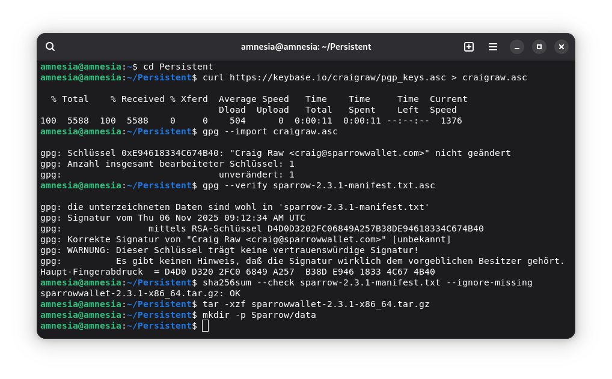
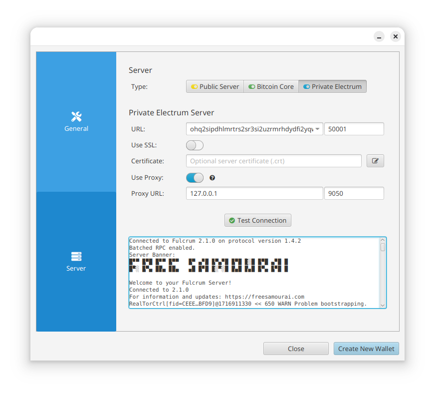

# Sparrow Wallet unter Tails OS nutzen

Diese Anleitung zeigt dir, wie du [Sparrow Wallet](../sparrow-wallet/) unter Tails OS persistent installierst – ohne die Anwendung bei jedem Systemstart neu einrichten zu müssen.
Der Fokus liegt dabei auf **Watch-Only-Wallets** und dem Management deiner UTXOs.
**Private Keys oder Seed Phrases werden niemals im Persistent Storage gespeichert.**

## Sicherheitswarnung

[Tails OS ist ein amnesisches Betriebssystem](../tails-os-privatsphaere-betriebssystem/), das nach jedem Neustart seinen Zustand vergisst.
Das ist für die Sicherheit gut, aber unpraktisch, wenn du regelmäßig mit Sparrow arbeiten willst.
Die Lösung: Sparrow selbst und seine Konfiguration (Server-Daten, Watch-Only-Wallets, Labels) in den Persistent Storage legen.

:::warning Kritische Einschränkung!
Speichere **niemals** Seeds oder private Keys im Persistent Storage.
Tails schützt nur vor Datenverlust, nicht vor Diebstahl oder kompromittiertem System.
Der Use-Case für dieses Setup ist eindeutig:
**Airgap-Workflows** mit Hardware Wallets oder die Verbindung zu einer entfernten Node über Tor.
:::

Du brauchst diese Anleitung nicht, wenn du unter Tails OS nur gelegentlich eine Transaktion signieren willst.
Dann reicht es gegebenenfalls, Sparrow bei jedem Start frisch zu installieren.
Diese Anleitung richtet sich an Nutzer, die mit Sparrow Wallet unter Tails OS regelmäßig UTXOs analysieren, Labels pflegen oder MultiSig-Setups verwalten.

## Voraussetzungen

- Tails OS ≥ 7.0 auf USB-Stick installiert
- Hardware Wallet (z.B. ColdCard, BitBox02) oder Zugang zu einer entfernten Bitcoin-Node
- Mindestens 500 MB freier Speicher im Persistenz-Volume

## Persistent Storage konfigurieren

Sobald du Tails OS gestartet hast, kannst du unter <kbd>Applications › Tails › Persistent Storage</kbd> ein persistentes Speichermedium einrichten.
Dies ermöglicht es dir, Daten über einzelne Sitzungen hinaus zu speichern.

Aktiviere die benötigten Optionen:

- **Personal Data → Persistent folder** (speichert Sparrow-Programmdateien)
- **Advanced Settings → Dotfiles** (ermöglicht Desktop-Verknüpfungen)


Starte Tails nach der Konfiguration neu und entsperre das Persistent Storage.

## Sparrow herunterladen und verifizieren

Öffne den Tor Browser und lade Sparrow herunter:

1. **Download**: https://sparrowwallet.com/download/
2. **Version**: Wähle **Linux (Intel/AMD) Standalone** (nicht das .deb-Paket!)
3. **Dateien**: `sparrow-[VERSION]-x86_64.tar.gz`, sowie das dazugehörige Manifest und dessen Signatur.


Öffne ein Terminal <kbd>Applications › Favorites › Terminal</kbd> und folge der [Verifizierungsanleitung am Ende der Download-Seite](https://sparrowwallet.com/download/#earlier-releases):


:::warning Überspringe die Verifikation nicht!
Nach dem Download ist die [Verifikation der heruntergeladenen Dateien](../software-verifizieren/) Pflicht, insbesondere da du diese im persistenten Speicher ablegst und auch in Zukunft auf ihre Integrität vertraust.
:::

## Ordnerstruktur anlegen

Erstelle im Terminal nun auch die Verzeichnisstruktur für Sparrow:
Das `data`-Verzeichnis wird später alle Konfigurationen, Watch-Only-Wallets und Labels enthalten:

```bash
# Verzeichnisstruktur erstellen
mkdir -p ~/Persistent/Sparrow/data
# Programmdateien entpacken
tar -xzf ~/Tor\ Browser/sparrow-*.tar.gz -C ~/Persistent/Sparrow/
```

Nach dem Entpacken hast du drei Ordner in `~/Persistent/Sparrow/`:

- `bin/` (Startskript)
- `lib/` (Programmbibliotheken)
- `data/` (dein noch leeres Datenverzeichnis)


### Erststart über Terminal testen

Starte Sparrow direkt aus dem Terminal, um die Pfade zu testen:

```bash
~/Persistent/Sparrow/bin/Sparrow -d ~/Persistent/Sparrow/data
```

**Was passiert**: Sparrow öffnet sich, erkennt ein leeres Datenverzeichnis und fragt nach der Server-Konfiguration.
Schließe Sparrow wieder – es geht beim Erststart nur darum, die korrekten Pfade und Berechtigungen zu testen.

Falls du eine Fehlermeldung siehst, prüfe:

- Ist das Archiv richtig entpackt?
- Hast du Schreibrechte auf `~/Persistent/Sparrow/data`? (korrigiere ggf. mit `chmod 755 ~/Persistent/Sparrow/data`)

## Desktop-Integration erstellen

Eine normale `.desktop`-Datei im Home-Verzeichnis wäre nach dem Neustart weg.
Die Lösung ist es, die [Sparrow.desktop](https://github.com/sparrowwallet/sparrow/blob/master/src/main/deploy/package/linux/Sparrow.desktop) Datei im Dotfiles-Ordner anzulegen, den wir im Schritt oben als Teil des Persistent Storage konfiguriert hatten:

```bash
# Verzeichnis erstellen
mkdir -p /live/persistence/TailsData_unlocked/dotfiles/.local/share/applications
# Datei anlegen
cat > nano /live/persistence/TailsData_unlocked/dotfiles/.local/share/applications/Sparrow.desktop <<EOF
[Desktop Entry]
Name=Sparrow
Comment=Sparrow
Exec=/opt/sparrowwallet/bin/Sparrow %U
Icon=/opt/sparrowwallet/lib/Sparrow.png
Terminal=false
Type=Application
Categories=Finance;Network;
MimeType=application/psbt;application/bitcoin-transaction;application/pgp-signature;x-scheme-handler/bitcoin;x-scheme-handler/auth47;x-scheme-handler/lightning
StartupWMClass=Sparrow
SingleMainWindow=true
EOF
```


### Sofort-Test der Desktop-Verknüpfung

```bash
cp /live/persistence/TailsData_unlocked/dotfiles/.local/share/applications/Sparrow.desktop ~/.local/share/applications/
```

Sparrow sollte nun im Anwendungsmenü <kbd>Applications › Other › Sparrow</kbd> erscheinen und starten.

## Tor-Proxy-Konfiguration in Sparrow

Tails leitet den gesamten Traffic automatisch über Tor.
Sparrow kann diesen Tor-Proxy mitnutzen:

1. Sparrow starten und die Einstellungen unter <kbd>Preferences → Server</kbd> öffnen
2. Private Electrum Server ([deine eigene Node](../bitcoin-fullnode/), auch über Tor erreichbar)
3. Konfiguration:
   - **Use proxy**: Aktiviert
   - **Proxy URL**: `127.0.0.1`
   - **Port**: `9050`



Prüfe im Dateimanager: `~/Persistent/Apps/Sparrow/data/` sollte nun Dateien enthalten.

## Neustart-Test

1. System neu starten
2. Persistent Storage entsperren
3. Mit Tor verbinden
4. Sparrow aus dem Menü starten
5. **Erfolgskriterium**: Deine Server-Konfiguration ist noch da

## Fazit & Best Practices

Du hast nun Sparrow Wallet persistent unter Tails OS installiert.
Was bleibt erhalten:

- **Programmdateien**: Sparrow selbst (kein Neudownload nötig)
- **Konfiguration**: Server-Einstellungen, Proxy, UI-Präferenzen
- **Watch-Only-Wallets**: xPubs, Transaktionshistorie, Labels

Was **niemals** hier landen darf:

- Seed Phrases und Private Keys
- Exporte von Hardware Wallets mit sensiblen Metadaten

### Quellen & Danksagung

Diese Anleitung basiert auf Daniel Costas' Artikel [Installing Sparrow Wallet on TailsOS persistently](https://danielpcostas.dev/installing-sparrow-wallet-on-tailsos-persistently/), welcher wiederum die [Anleitung: Tails Linux mit Sparrow Wallet](https://forum.blocktrainer.de/t/anleitung-tails-linux-mit-sparrow-wallet/28775) als Grundlage nutze.
