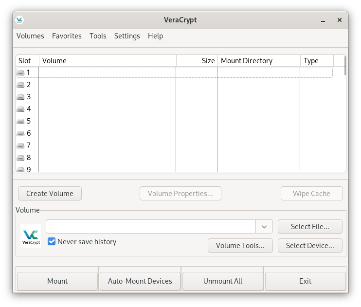

# Digitale Backups mit Tails OS und VeraCrypt

Digitale Backups haben einen zweifelhaften Ruf – und das zu Recht, denn es gibt mehrere Fallstricke zu beachten.
In Kombination mit [Tails OS](../tails-os-privatsphaere-betriebssystem/) (wenn amnesisch und offline genutzt) und [VeraCrypt](https://veracrypt.io/en/) (auditierte Verschlüsselung) wird das Risiko jedoch kontrollierbar.
Dieser Artikel zeigt dir, wie du ein air-gapped, verschlüsseltes Backup deiner Seed Phrase erstellst, das **neben deinen physischen Metall-Backups als zusätzliche Sicherung** dienten kann.

## Warum digitale Backups trotz Risiken sinnvoll seien können

**Vorteile**: Kompakt, einfach zu duplizieren, platzsparend. Du kannst 10 Kopien an 10 Orten lagern, ohne dass es auffällt.
Ein verschlüsselter USB-Stick in einem Bankschließfach fällt nicht als "Wertsache" auf und ist auch ein unauffälliger Reisebegleiter.

**Mögliche Anwendungfälle**: Du hast bereits zwei Metall-Backups und willst eine **diskrete, leicht transportable** Kopie für eine längeren Reise oder den Fall, dass beide Metallplatten verloren gehen (z.B. Naturkatastrophe im Wohngebiet).
==Digitale Backups sind **kein Ersatz**, sondern eine Ergänzung.==

**Risiken**:

- Ein digitales Backup ist nur so sicher, wie das Gerät, auf dem es erstellt wurde. Key-Logger sind auch auf Tails OS theoretisch möglich.
- Vergessene Passwörter, denn es ist kein Passwort-Reset möglich.
- Bitrot: Datenverfall auf dem Speichermedium.
- Technologie-Obsoleszenz: Wie steht es um USB-A in 20 Jahren?

## Voraussetzungen & Sicherheitswarnungen

**Hardware**:

- USB-Stick mit aktuellem Tails OS
- Zweiter USB-Stick oder SD-Karte für das Backup (≥ 4 GB)
- Optionale weitere Medien für zusätzliche Kopien

**Wichtig**: Deine Medien müssen **neu** oder **sicher gelöscht** sein.
Kaufe lieber neu, anstatt schnell einen alten USB-Stick wiederzuiverwenden.

**Sicherheitswarnungen**:

- **Erstelle das Backup nur auf Tails OS**, nie auf deinem Hauptsystem.
- **Trenne das Backup-Medium nach der Erstellung sofort vom System**.
- **Vergisst du das VeraCrypt-Passwort, ist das Backup wertlos** – ohne Recovery-Option. Nutze daher auch hier eine gut durchdachte Art des Backups.

## Tails OS vorbereiten und VeraCrypt installieren

VeraCrypt ist eine leistungsstarke Verschlüsselungssoftware, die fortschrittliche Algorithmen und Verschlüsselungstechniken verwendet.
Sie bietet eine benutzerfreundliche Oberfläche und kann verschlüsselte Container erstellen, die als virtuelle Laufwerke gemountet werden können.
Es ist Open Source Software, kostenlos und für mehrere Plattformen verfügbar.

Tails OS kann von Haus aus [VeraCrypt-verschlüsselte Partitionen verwenden](https://tails.net/doc/encryption_and_privacy/veracrypt/index.de.html) und zum Entschlüsseln ist keine zusätzliche Software erforderlich.
Zum Erstellen verschlüsselter Partitionen müssen wir jedoch [VeraCrypt herunterladen](https://veracrypt.io/en/Downloads.html) und installieren.

Gehe folgendermaßen vor:

1. Starte Tails
    - **mit Adminstrator Passwort**: <kbd>Additional Settings › Administration Password</kbd> — wir benötigen die Adminfunktionen, um VeraCrypt zu installieren.
    - **ohne Persistent Storage**: Wir wollen ein sauberes, amnesisches System. Das Backup wird auf dem externen Medium liegen, nicht auf dem Tails-Stick.
2. Gehe online: Verbinde dich mit Tor und öffne den Tor-Browser
3. Lade von https://veracrypt.io/en/Downloads.html folgende Dateien herunter (`XX` durch die aktuelle Version ersetzen):
    - `veracrypt-1.XX.XX-setup.tar.bz2` (Generic Installer)
    - `veracrypt-1.XX.XX-setup.tar.bz2.sig` (PGP Signature)
    - `veracrypt-1.XX.XX-sha256sum.txt` (unten bei Checksums)
    - `veracrypt-1.XX.XX-sha256sum.txt.sig` (PGP Signature)
    - `VeraCrypt_PGP_public_key.asc` (am Seitenende)

    

4. Öffne ein Terminal <kbd>Applications › System Tools › Console</kbd>
5. Verifiziere die heruntergeladenen Dateien:
    - Überprüfe die PGP-Signaturen anhand der [Anleitung auf der VeraCrypt-Website](https://veracrypt.io/en/Digital%20Signatures.html)
    - **Überspringe diesen Schritt nicht**: Supply-Chain-Angriffe sind real!

    
6. Trenne die Internet-Verbindung und **stelle sicher, dass du offline bist**.
7. Entpacke und installiere VeraCrypt:

    ```sh
    # Bundle entpacken
    tar -xf veracrypt-1.XX.XX-setup.tar.bz2
    # VeraCrypt GUI-Version installieren
    ./veracrypt-1.XX.XX-setup-gui-x64
    ```

8. In der folgenden Installation:
    - Option 1 wählen
    - <kbd>Enter</kbd> drücken und die Lizenzbedingungen akzeptieren (mit <kbd>G</kbd> kannst du direkt ans Ende der Lizenzbedingungen springen)
    - Das Administrator Passwort angeben, sobald du danach gefragt wirst (ggf. mehrfach)

    
9. Wenn alles geklappt hat, kannst du nun mit dem Befehl `veracrypt` in der Console das Programm öffnen.
   Ebenso solltest du VeraCrypt auch über die <kbd>Activities</kbd> Übersicht aufrufen können (Button oben links in der Menüleiste neben "Apps", dann Suche nach "Veracrypt").
    

## Erstellung eines verschlüsselten Volumes

Jetzt wo VeraCrypt nutzbar ist, **stelle erneut sicher, dass du offline bist**, bevor du dich den kommenden Schritte widmest.

Wir werden im folgenden größtenteils die voreingestellten Option nutzen.
Wenn du tiefer einsteigen und weitere Informationen zu den einzelnen Optionen möchtest, findest du alle Details in der [VeraCrypt Dokumentation](https://veracrypt.io/en/Documentation.html).

1. Leg dein Backup-Medium (USB-Stick, SD-Karte) ein
2. Klicke auf <kbd>Create Volume</kbd> im VeraCrypt-Fenster
3. Wähle die Option <kbd>Encrypt a non-system partition/drive</kbd>
4. **Volume Type**: Hier gibt es die wichtigste Entscheidung zu treffen, daher sehen wir uns die beiden Optionen im Detail an…

### Standard vs. Hidden Volume – Plausible Deniability erklärt

**Standard Volume**: Eine normale, verschlüsselte Partition.
Wenn jemand deinen USB-Stick findet und einlegt, ist sofort erkennbar, dass es sich um verschlüsselte Daten handelt.

**Hidden Volume**: Ein **zweites, verstecktes Volume**, welches *innerhalb* des freien Speicherplatzes eines Standard Volumes liegt. Sie hat ein **zweites, separates Passwort**. VeraCrypt schreibt zufällig wirkendes Rauschen in den freien Speicher – das Hidden Volume ist technisch **nicht nachweisbar**.

**In der Praxis**: Die Option Hidden Volume erstellt einen VeraCrypt-Container mit **zwei Passwörtern**:

- Passwort A für das äußeres Standard Volume: Enthält ein paar sensible, aber harmlose Dateien (z.B. alte Steuerunterlagen)
- Passwort B für das innere, Hidden Volume: Enthält deine Seed Phrase und andere hochsensible Dateien

**Szenario**: Du wirst unter Druck gesetzt, das Passwort einzugeben.
Du offenbarst das Passwort für das äußere Standardvolume und der Angreifer sieht von dir bereitgestellte sensible Dateien, kann aber nicht wissen oder beweisen, dass noch ein Hidden Volume existiert.

**Kritische Warnung**: Wenn du Passwort A nutzt, kann VeraCrypt das Hidden Volume **nicht schützen**. Schreibst du auf das äußere Volume, **überschreibst du** potenziell das Hidden Volume. VeraCrypt warnt dich nicht. Das ist die häufigste Fehlerquelle.

**Relevanz für Bitcoin-Backups**: Wenn du ein Überfall-Szenario für wahrscheinlich hältst.
Ein Hidden Volume erhöht die Komplexität und wenn du Passwort A unter Druck hergibst, musst du sicher sein, dass der Angreifer mit den "Decoy"-Dateien zufrieden ist.

**Empfehlung**: Wenn du dir unsicher bist, starte mit einem **Standard Volume** und lerne den Workflow kennen.
Später kannst du dein Bedrohungsmodell erneut evaluieren und gegebenenfalls auf ein Hidden Volume wechseln.

Der Vollständigkeit halber wählen wir hier zur Erklärung den kompleren Weg, welcher das Prozedere zwei Mal durchläuft…


5. **Volume Type**: Wähle <kbd>Hidden VeraCrypt volume</kbd>.
6. **Location**: Wähle über <kbd>Select Device…</kbd> das zu verschlüsselnde Gerät oder Partition.
7. **Outer Volume Encryption Options**: Übernehme die Standardauswahl <kbd>AES</kbd> und <kbd>SHA-512</kbd>.
8. **Outer Volume Password**: Gib das Passwort für das äußeres Standard Volume an. Wähle ein langes Passwort, welches du auch mit einem Passwort-Manager generieren und speichern kannst.
9. **Large Files**: Wähle <kbd>No</kbd> (sofern du keine Dateien > 4GB zu sichern hast).
10. **Volume Format**: Wähle <kbd>FAT</kbd> (größtmögliche Kompatibilität).
11. **Outer Volume Format**: Bewege den Mauszeiger beliebig über das VeraCrypt-Fenster, um Entropie/Zufall zu erzeugen. Schließe mit <kbd>Format</kbd> ab.
12. **Outer Volume Contents**: Erstelle nun die Decoy-Dateien für das äußere Standard Volumen.

Hier wäre nun das Ende des Prozess, wenn du dich für das einfache Standard Volume entschieden hast.
In dem Fall kannst dui die folgende Liste überspringen.

13. **Hidden Volume Encryption Options**: Übernehme die Standardauswahl <kbd>AES</kbd> und <kbd>SHA-512</kbd>.
13. **Hidden Volume Size**: Wähle eine ausreichende Größe, nutze aber nicht den gesamten freien Speicher, um zu verhindern, dass Änderungen im Outer Volume dir das Hidden Volume zerstören.
14. **Hidden Volume Password**: Gib das Passwort für das Hidden Volume an. Wähle ein anderes, langes Passwort, welches du an anderer Stelle mit einem Passwort-Manager speichern kannst.
15. **Volume Format**: Wähle <kbd>FAT</kbd> (größtmögliche Kompatibilität).
16. **Hidden Volume Format**: Bewege den Mauszeiger beliebig über das VeraCrypt-Fenster, um Entropie/Zufall zu erzeugen. Schließe mit <kbd>Format</kbd> ab.
17. Lies und bestätige den Text mit Informationen zum **Schutz des Hidden Volumes gegen Zerstörung durch Schreiboperationen im Standard Volume**. Setze dich auch mit den hier beschriebenen [Details zum Schutz des Hidden Volumes](https://veracrypt.io/en/Protection%20of%20Hidden%20Volumes.html) auseinander, wenn du nachträglich die Dateien im äußeren Standard Volume anpassen möchtest.

Nun endlich haben wir das Backup-Medium verschlüsselt und können unsere Daten sicher aufbewahren.

Prüfe mit den folgenden Schritten, dass alles geklappt hat:

1. In VeraCrypt, wähle <kbd>Select Device…</kbd> im `Volume` Feld unten.
2. Wahle das Gerät oder die Partition, die du in den vorigen Schritten verschlüsselt hast.
3. Wähle <kbd>Mount</kbd> und gib das Passwort für das Standard Volume an.
4. Du solltest das Volume nun durch Doppelklick öffnen können und deine Decoy-Dateien sehen.
5. Wähle <kbd>Unmount All</kbd>, um das Medium auszuwerfen.

Wenn du das Hidden Volume nutzt, wiederhole die Schritte mit deinem Hidden Volume Passwort — du solltest ein leeres Volume vorfinden, mit dem wir nun weiter machen.

## Seed Phrase sicher speichern

Wir starten nun zunächst Tails neu, um sicherzustellen, dass wir **offline arbeiten** und es keine Überreste vom Erstellungsprozess des Backup-Mediums gibt.

1. Starte Tails
    - **im Offline-Modus**: <kbd>Additional Settings › Offline Mode › Disable all networking</kbd>
    - **ohne Persistent Storage**: Wir wollen ein sauberes, amnesisches System.
2. Unter <kbd>Apps › Utilities › Unlock VeraCrypt Volumes</kbd> kannst du nun das mit Tails OS gelieferte Tool zum Entschlüsseln deines Backup-Mediums nutzen.
3. Wahle das Gerät oder die Partition, die du in den vorigen Schritten verschlüsselt hast und klicke <kbd>Unlock</kbd>
4. Im darauffolgenden Dialog eine der beiden Optionen, je nach deinem Anwendungsfall:
    - Standard Volume: Passwort A
    - Hidden Volume: Passwort B und die Option <kbd>Hidden Volume</kbd>
5. Öffne nun das entschlüsselte Volume und lege dort Dateien mit deinen geheimen Daten an.

**Wichtig**: Deine Seed-Dateien sollten **nur** die 12/24 Wörter enthalten – keine Passphrase, keine Erklärungen, keine Metadaten.
Das minimiert das Risiko, sollte doch mal jemand an diese Daten gelangen.

## Backup-Strategie: Mehrere Kopien

Erstelle **mindestens zwei** identische VeraCrypt-Volumes auf **zwei verschiedenen Medien**.
Du kannst dafür auch einen **Medien-Mix** wählen:

- USB-Stick (hohe Verfügbarkeit)
- SD-Karte (diskret, passt in jede Geldbörse)
- Externe SSD (langlebiger, aber auffälliger)

Leider lassen sich die verschlüsselten Volumes nicht direkt klonen und [VeraCrypt rät dringend vom Klonen ab](https://veracrypt.io/en/Volume%20Clones.html).
Daher musst du den oben beschriebenen Prozess erneut für deine weiteren Backup-Medien durchlaufen.

:::tip Wichtiger Ratschlag
Verschlüssele alle zusätzlichen Volumes mit demselben Passwort, welches du auch für das erste Medium genutzt hast.
Sonst vergisst du, welches Passwort zu welchem Volume gehört.
:::

## Best Practices & Warnungen

Du hast jetzt ein **air-gapped, verschlüsseltes, redundantes** digitales Backup deiner Seed Phrase.

==Ein digitales Backup ist jedoch **kein Ersatz** für deine Metall-Backups, sondern eine **zusätzliche Sicherung** für den Fall der Fälle.==

### **Do's**

- **Nur offline erstellen**: Kein Netzwerk, kein WLAN, kein Bluetooth.
- **Getrennte Passphrase**: Speichere die Passphrase **nicht** in der VeraCrypt-Datei.
- **Mehrere Kopien**: Mindestens zwei Medien, an zwei Orten.
- **Regelmäßige Tests**: Jährlich, am besten auf verschiedenen Rechnern.
- **Dokumentation**: Lass deine Erben wissen, wie sie das Backup entschlüsseln können.

### **Dont's**

- **Kein Persistent Storage**: Der Tails-Stick sollte nach dem Shutdown keine Spuren der VeraCrypt-Installation oder deiner Seeds enthalten.
- **Kein schwaches Passwort**: Nutze einen Passwort-Manager zum Erstellen und Speichern der VeraCrypt-Passwörter.
- **Kein einzelnes Medium**: Ein einzelner USB-Stick ist kein Backup.
